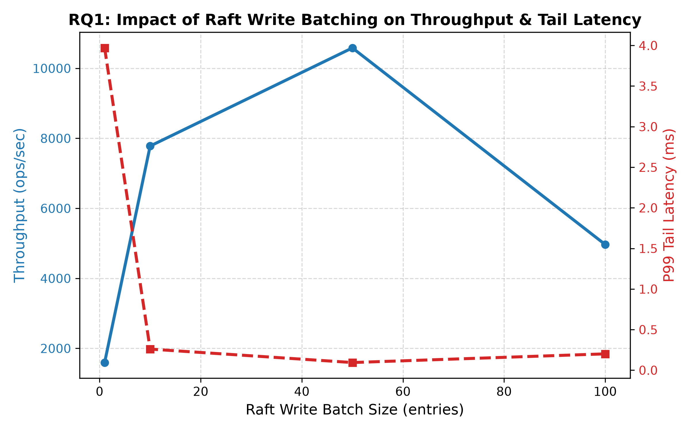
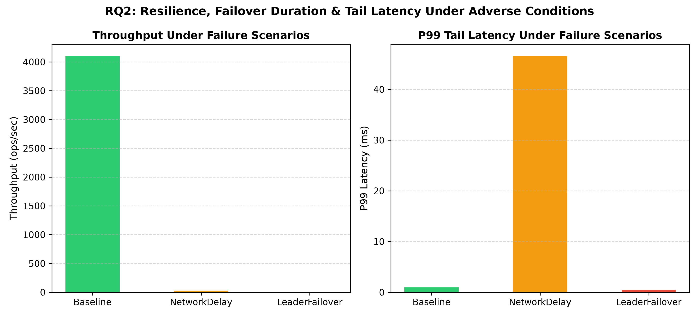
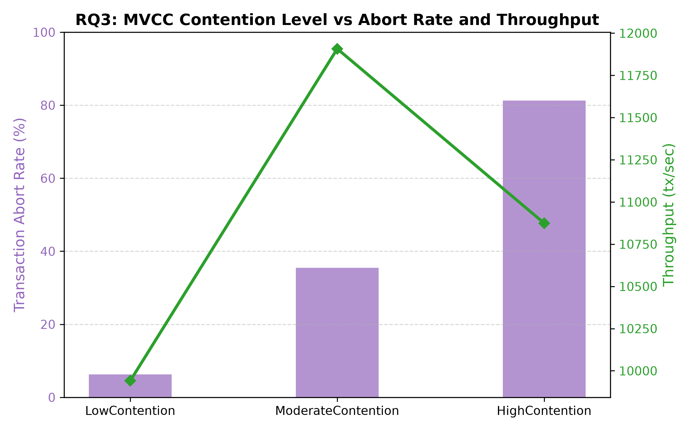

# AegisDB

> **A Fault-Tolerant Distributed Transactional Database Engine in Java**

AegisDB is a distributed transactional database built from the ground up in Java 25. The project implements Raft consensus for strong consistency, fault-tolerant Write-Ahead Logging (WAL) and snapshots for persistent crash recovery, MVCC for isolated transactions, and horizontal sharding with Two-Phase Commit (2PC).

---

## Module Structure

The file and module structure is uniformly aligned with the repository name **AegisDB**:

```text
AegisDB/
├── pom.xml                   # Parent POM (Java 25, gRPC, Protobuf, JUnit 5)
├── README.md                 # Project documentation & instructions
├── LICENSE                   # MIT License
├── docker/                   # Docker and container configurations
├── docs/                     # Architecture, guarantees & failure models
│   ├── architecture.md       # System architecture & layer decoupling
│   ├── failure_model.md      # Failure model (fail-stop, crash-recovery, network)
│   ├── consistency.md        # Consistency model (Linearizability, Snapshot Isolation)
│   ├── raft.md               # Raft consensus engine documentation
│   ├── storage.md            # Storage engine, WAL & recovery documentation
│   └── snapshots.md          # Snapshot framing, chunked RPC & log compaction
├── scripts/                  # Build, test, and live demonstration scripts
├── experiments/              # Performance benchmarks and experiments
│
├── aegisdb_common/           # Domain models (NodeId, Endpoint, NodeStatus, Configs)
├── aegisdb_protocol/         # Protobuf contracts and gRPC RPC definitions
├── aegisdb_transport/        # Transport abstraction (InMemoryTransport, GrpcRaftTransport)
├── aegisdb_raft/             # Raft Consensus Engine (Election, Heartbeats, State, Invariants, Snapshots)
├── aegisdb_storage/          # Disk persistence, WAL, CRC32 Checksums, Snapshots & Recovery
├── aegisdb_mvcc/             # Multi-Version Concurrency Control (Version chains, Snapshots, GC)
├── aegisdb_transaction/      # Single-Shard Transaction Engine (ACID, Read/Write Sets, Validation, Commit/Abort)
├── aegisdb_sharding/         # Horizontal Sharding, Topology & Dynamic Query Routing
├── aegisdb_chaos/            # Fault injection, network partitions, packet drops & continuous invariant monitoring
├── aegisdb_management/       # Secure REST Management API, RBAC Bearer Token Auth & Security Guardrails
├── aegisdb_observability/    # OpenTelemetry metrics, distributed tracing & Prometheus exposition
├── aegisdb_benchmark/        # Reproducible research benchmark harness (RQ1-RQ3) with JSON/CSV export
├── aegisdb_node/             # Node lifecycle (DatabaseNode, NodeBootstrap, NodeLifecycle)
├── aegisdb_client/           # Java Client SDK (AegisDbClient, transparent redirect/retry, transactional client)
└── aegisdb_integration/      # Acceptance tests & verification demos for Sprints 1-11
```

---

## Sprint 1: Cluster Foundation & Networking

Sprint 1 establishes the foundation for cluster communication and node management:
- **US003:** As an operator, I want to start multiple nodes.
- **US004:** As a node, I want to communicate with other nodes.

### Completed Acceptance Criteria (Sprint 1)

| Criterion | Description | Status |
|---|---|:---:|
| **Three nodes start** | Three nodes start concurrently and reach `RUNNING` status. | ✅ PASS |
| **Nodes have unique identities** | Each node is assigned a unique `NodeId` and dedicated `Endpoint` (port). | ✅ PASS |
| **Node A can call Node B** | RPC calls (`RequestVote`, `AppendEntries`) are dispatched and handled via gRPC and InMemory transports. | ✅ PASS |
| **Timeout works** | Unavailable or unresponsive nodes trigger a controlled timeout. | ✅ PASS |
| **Errors propagate correctly** | Invocations to stopped or unreachable nodes propagate cleanly as `TransportException`. | ✅ PASS |
| **Nodes stop gracefully** | Nodes terminate cleanly, releasing network and execution resources to reach `STOPPED` status. | ✅ PASS |

---

## Sprint 2: Raft Consensus Engine - Leader Election

Sprint 2 implements the Raft consensus engine leader election (US005) with a single-threaded event loop, randomized election timers, and strict safety invariants:
- **US005:** As a cluster, we want to elect a leader via Raft leader election.

### Completed Acceptance Criteria (Sprint 2)

| Criterion | Description | Status |
|---|---|:---:|
| **Exactly one leader exists per term** | At most one leader is elected per term (Election Safety Invariant). Election requires absolute quorum (`N/2 + 1`). | ✅ PASS |
| **Followers reset timeout after valid heartbeat** | The leader sends periodic heartbeats (`AppendEntries`). Followers reset their election timer and remain in follower state. | ✅ PASS |
| **New leader is elected after failure** | When a leader crashes, remaining nodes detect election timeout and safely elect a new leader in an incremented term. | ✅ PASS |

### Architecture & Invariants (Sprint 2)
- **Single-Threaded Event Loop**: All state transitions execute sequentially via a dedicated queue (`Executors.newSingleThreadExecutor`) eliminating concurrency race conditions.
- **Pluggable Clock & Scheduler Abstraction**: `Clock` (`SystemClock`, `TestClock`) and `Scheduler` (`SystemScheduler`, `DeterministicScheduler`) enable fast deterministic simulation testing without fragile sleeps.
- **Strict Architectural Decoupling**: ArchUnit architecture tests verify that `aegisdb_raft` has zero dependencies on Spring, management, benchmarks, or chaos modules.

---

## Sprint 3: Raft Consensus Engine - Log Replication

Sprint 3 implements Raft log replication (US006) per Ongaro §5.3/§5.4 with majority acknowledgments, commit index monotonicity, and automated conflict resolution:
- **US006:** As a leader, I want to replicate writes to a majority before commit.

### Completed Acceptance Criteria (Sprint 3)

| Criterion | Description | Status |
|---|---|:---:|
| **Writes replicate** | The leader receives client proposals (`propose`), appends to local `RaftLog`, and replicates entries to followers. | ✅ PASS |
| **Majority required** | Writes are committed only once acknowledged by a strict majority ($N/2 + 1$) of nodes. Minority partitions are safely blocked from committing. | ✅ PASS |
| **CommitIndex advances correctly** | `commitIndex` advances monotonically per Ongaro §5.3/§5.4 (leaders commit entries from the current term). | ✅ PASS |
| **Follower catches up** | A disconnected follower that reconnects automatically receives all missing entries and synchronizes to the leader's `commitIndex`. | ✅ PASS |
| **Conflicting entries are repaired** | Diverging, uncommitted entries in a follower's log are truncated and overwritten with authoritative leader entries via `LogConflictResolver`. | ✅ PASS |

### Architecture & Safety Invariants (Sprint 3)
- **1-based Log Indexing**: `RaftLog` uses 1-based sequence numbering with a sentinel entry at index 0.
- **Single-Threaded Event Loop**: Client writes (`ClientWriteEvent`) and replication responses (`AppendEntriesResponseEvent`) are processed sequentially without locks.
- **Core Raft Invariants**: Continuously verified at runtime and across test suites:
  - *Committed entries are never overwritten*
  - *Committed entries appear in identical order across all nodes*

---

## Sprint 4: Persistence and Recovery

Sprint 4 implements local fault-tolerant persistence and crash recovery per Master Project Plan §8 & §17 (US007 & US008):
- **US007:** As a database, I want committed data to survive crashes.
- **US008:** As a Raft node, I want term/votedFor to be durable across restarts.

### Completed Acceptance Criteria (Sprint 4)

| Criterion | Description | Status |
|---|---|:---:|
| **WAL segments and checksums** | Segment files (`wal-00000000000000000001.seg`) with automatic rollover at size thresholds and CRC32 checksums over headers and payloads. | ✅ PASS |
| **Flush/fsync policy** | Configurable synchronization policy (`ALWAYS`, `PERIODIC`, `MANUAL`). `ALWAYS` guarantees physical disk durability via `force(true)` before acknowledging writes. | ✅ PASS |
| **Persistent term/votedFor** | `currentTerm` and `votedFor` are saved atomically via write-to-temp + `fsync` + `ATOMIC_MOVE` before replying to RPCs (Ongaro §5.2). | ✅ PASS |
| **Partial-write recovery** | Incomplete writes at EOF (torn tails from sudden power loss) are automatically detected on startup and safely truncated to the last intact record. | ✅ PASS |
| **Corruption detection** | Bit flips, invalid magic numbers, or mismatched CRC32 checksums in existing records are instantly flagged with `CorruptedWalException`. | ✅ PASS |
| **Restart tests** | 3-node cluster survives abrupt process termination. All nodes recover term, votes, and log sequence from disk and resume consensus cleanly. | ✅ PASS |

### Architecture & Security (Sprint 4)
- **DurableRaftLog**: Drop-in extension of `RaftLog` providing synchronous write-through to WAL and durable `fsync` before in-memory state updates.
- **Path Traversal Protection**: Data directory validation prevents unauthorized directory traversal attacks.
- **Bounded Resource Allocations**: Record allocations are strictly bounded to 16 MB max to prevent memory exhaustion attacks from crafted headers.
- **Zero-Dependency Architecture**: `aegisdb_storage` maintains zero dependencies on Spring and gRPC.

---

## Sprint 5: Snapshots and Replicated Key-Value Store (Milestone M2 Gate)

Sprint 5 implements log compaction via snapshots, chunked `InstallSnapshot` RPC, a replicated Key-Value State Machine, and client SDK (US009 & US010; Milestone M2 Gate):
- **US009:** As a database node, I want snapshots so the log does not grow unbounded.
- **US010:** As a client, I want replicated key-value operations.

### Completed Acceptance Criteria (Sprint 5)

| Criterion | Description | Status |
|---|---|:---:|
| **Snapshot metadata and checksum** | Point-in-time snapshots (`snapshot-%020d-%020d.snap`) with Magic `0xAE615DA2`, versioning, framing, and CRC32 checksums. Atomic `.tmp` + `ATOMIC_MOVE` with retention of 2 latest snapshots. | ✅ PASS |
| **Snapshot install** | Chunked `InstallSnapshot` RPC over gRPC & InMemoryTransport with 64 KB chunking, offset, done flag, and CRC32 validation (Raft §7). | ✅ PASS |
| **KeyValueStateMachine** | Thread-safe `ConcurrentSkipListMap`-backed state machine supporting PUT, GET, DELETE with deterministic binary serialization and atomic snapshot restore. | ✅ PASS |
| **Client PUT/GET/DELETE** | Dedicated Java SDK module `aegisdb_client` with `AegisDbClient` and `DefaultAegisDbClient`. Provides automatic leader discovery and transparent redirect/retry on `NotLeaderException`. | ✅ PASS |
| **Follower catch-up from snapshot** | Disconnected or lagging followers whose missing log entries have been compacted away are automatically brought up to date via `InstallSnapshot`. | ✅ PASS |
| **Milestone M2 Gate** | 3-node persistent replicated key-value cluster survives leader crash, undergoes safe re-election, and enables clients to continue reads and writes without data loss. | ✅ PASS |

---

## Sprint 6: Multi-Version Concurrency Control (MVCC) and Snapshot Isolation

Sprint 6 implements lock-free multi-version storage, point-in-time snapshot isolation, strict visibility rules, and watermarked garbage collection per Master Project Plan §9 & §17 (US011):
- **US011:** As a transaction, I want to read a stable snapshot while other writes occur.

### Completed Acceptance Criteria (Sprint 6)

| Criterion | Description | Status |
|---|---|:---:|
| **Version chains** | Singly-linked list per key with atomic CAS head updates (`VersionChain`, `VersionedValue`). Readers traverse without locks. | ✅ PASS |
| **Snapshot timestamps** | Monotonically increasing logical timestamps (`TimestampProvider`) creating immutable point-in-time snapshots (`Snapshot`). | ✅ PASS |
| **Visibility rules** | Pure visibility engine (`VisibilityRule`) enforcing future invisibility, dirty read prevention, and committed visibility. | ✅ PASS |
| **Uncommitted/aborted invisibility** | Readers never see uncommitted or aborted writes. Active transactions support Read-Your-Own-Writes and First-Committer-Wins conflict detection. | ✅ PASS |
| **Garbage collection safety** | Watermarked garbage collection (`MvccGarbageCollector`) guarantees active snapshot views are never deleted. Tombstones and obsolete versions safely reclaimed. | ✅ PASS |

### Architecture & Concurrency Guarantees (Sprint 6)
- **Lock-Free Reads**: Readers never block writers, and writers never block readers.
- **Pure Snapshot Isolation**: Complete immunity against Dirty Reads, Lost Updates, and Non-Repeatable Reads.
- **Raft Snapshot Integration**: Framed binary snapshot serialization (`0x4D564343` magic header with CRC32) for cluster log compaction.
- **Zero-Dependency Core**: `aegisdb_mvcc` module maintains zero dependencies on Spring, gRPC, or management frameworks.

---

## Sprint 7: Single-Shard Transactions (Milestone M3 Gate)

Sprint 7 implements atomic multi-operation local transactions, Read/Write Sets, commit validation, conflict detection, durable transaction logging, and financial invariant preservation per Master Project Plan §5, §9, §11, §14, §17, §18 & §20 (US012; Milestone M3 Gate):
- **US012:** As a client, I want multiple operations to commit atomically.

### Completed Acceptance Criteria (Sprint 7)

| Criterion | Description | Status |
|---|---|:---:|
| **Transaction state machine** | 4-state lifecycle (`ACTIVE -> PREPARING -> PREPARED -> COMMITTED / ABORTED`) with immutable terminal state checks. | ✅ PASS |
| **ReadSet / WriteSet** | In-flight read tracking and mutation buffering with Read-Your-Own-Writes and bounded size enforcement (`maxWriteSetSize`). | ✅ PASS |
| **ConflictDetector** | First-Committer-Wins conflict evaluation under Snapshot Isolation and read-set anti-dependency checking under Serializable mode. | ✅ PASS |
| **CommitValidator** | Precondition verification, transaction TTL timeout expiration, and conflict inspection prior to state commit. | ✅ PASS |
| **Snapshot Isolation tests** | Full anomaly suite verified: Dirty Read, Lost Update, Non-Repeatable Read, Write-Write Conflict, and Write Skew (SI vs SSI). | ✅ PASS |
| **Concurrent transfer invariant** | Master Plan §14 Bank Invariant ($A=1000, B=1000, C=1000 \to A+B+C=3000$) 100% conserved across 5,000+ operations. | ✅ PASS |
| **Durable TransactionLog** | Binary append-only log with magic `0xAE615D70`, CRC32 checksum framing, torn-tail truncation, and crash recovery. | ✅ PASS |
| **Milestone M3 Gate** | MVCC and single-shard transactions preserve invariants under sustained 16-thread multi-client concurrency. | ✅ PASS |

### Architecture & Concurrency Guarantees (Sprint 7)
- **ACID Guarantees**: Complete atomicity and point-in-time snapshot isolation for multi-operation transactions.
- **Idempotency & Deduplication**: Safe duplicate `commit`/`abort` handling and `ClientId + RequestId` transaction deduplication (Master Plan §10).
- **Resource Security**: Strict bounding on write-set memory allocations and transaction TTL timeouts (Master Plan §12).
- **Decoupled Architecture**: `aegisdb_transaction` maintains zero dependencies on Spring, gRPC, Protobuf, management, benchmark, or chaos modules per ArchUnit tests.
- **Sprint 7 Documentation**:
  - [Sprint 7 Completion & Verification Report](file:///c:/Users/mouaz/AegisDB/docs/sprint7-completion-report.md)
  - [Single-Shard Transactions Specification & Diagrams](file:///c:/Users/mouaz/AegisDB/docs/transactions.md)
  - [ADR 0007: Single-Shard Transactions and Concurrency Control](file:///c:/Users/mouaz/AegisDB/docs/adr/0007-single-shard-transactions.md)
  - [Sprints 1-7 Performance & Stress Benchmarks](file:///c:/Users/mouaz/AegisDB/experiments/sprints-1-to-7-benchmarks.md)


---

## Sprint 8: Sharding, Replication Groups & Dynamic Query Routing

Sprint 8 implements horizontal sharding, dynamic topology management, and transparent query routing per Master Project Plan §4, §5, §6, §10, §11, §12, §14, §17, §18 & §20 (US013, US014):
- **US013:** As a cluster, I want multiple shards so data is distributed.
- **US014:** As a client, I want operations routed to the correct shard automatically.

### Completed Acceptance Criteria (Sprint 8)

| Criterion | Description | Status |
|---|---|:---:|
| **MurmurHash3 partitioning** | Deterministic 32-bit MurmurHash3 key-to-shard mapping ($\text{floorMod}(\text{hash}(\text{key}), \text{shardCount})$) guaranteeing uniform key distribution across shards ($\pm 5\%$ of ideal mean). | ✅ PASS |
| **Multi-Raft replication groups** | Each shard is managed by an independent `ReplicationGroup` with dedicated Raft state machine, WAL, and consensus group. | ✅ PASS |
| **Dynamic leader locator** | `LeaderLocator` dynamically caches active shard leaders, processes leader redirect hints, and evicts stale entries on failure. | ✅ PASS |
| **Transparent query routing** | `QueryRouter` and `ShardedAegisDbClient` route `put`, `get`, and `delete` operations seamlessly across shards with automatic redirect handling and backoff retries. | ✅ PASS |
| **Shard fault isolation** | Leader failure, network partition, or re-election in one shard has zero impact on the availability and throughput of other shards. | ✅ PASS |
| **Multi-Raft invariant scoping** | Extended `RaftInvariants` tracking terms, leader uniqueness, and committed log prefixes on an independent per-consensus-group basis. | ✅ PASS |

### Architecture & Sharding Guarantees (Sprint 8)
- **Zero-Dependency Murmur3**: Standalone pure-Java 32-bit MurmurHash3 implementation without external library dependencies.
- **Strict Decoupling**: Core sharding topology remains transport-agnostic and completely independent of Spring or management APIs.
- **Sprint 8 Documentation**:
  - [Sprint 8 Completion & Verification Report](file:///c:/Users/mouaz/AegisDB/docs/sprint8-completion-report.md)
  - [Sharding Architecture & Topologies](file:///c:/Users/mouaz/AegisDB/docs/sharding.md)

---

## Sprint 9: Cross-Shard Distributed Transactions & Two-Phase Commit (Milestone M4 Gate)

Sprint 9 implements cross-shard atomic distributed transactions using the Two-Phase Commit (2PC) protocol, crash recovery journal, and OCC conflict detection per Master Project Plan §4, §5, §10, §11, §12, §14, §17, §18 & §20 (US015; Milestone M4 Gate):
- **US015:** As a client, I want distributed transactions across multiple shards with 2PC.

### Completed Acceptance Criteria (Sprint 9)

| Criterion | Description | Status |
|---|---|:---:|
| **Two-Phase Commit (2PC) protocol** | Parallel Phase 1 `PREPARE` broadcast across participant shards, durable coordinator state transitions, and Phase 2 `COMMIT` / `ABORT` fan-out with idempotent participant execution. | ✅ PASS |
| **Durable coordinator WAL** | `DurableCoordinatorLog` using binary record framing with magic header `0xAE6120C0`, CRC32 checksums, fsync on commit decisions, and torn-write tail truncation. | ✅ PASS |
| **8-scenario crash recovery matrix** | `DistributedTransactionRecovery` automatically replays coordinator journal on startup and resolves in-doubt transactions across all 8 failure modes defined in Master Plan §10. | ✅ PASS |
| **Key-level prepare locks & OCC** | `LocalShardParticipant` holds exclusive locks on prepared keys to prevent conflicting updates and validates read sets under Optimistic Concurrency Control for strict Serializability. | ✅ PASS |
| **Client SDK transaction integration** | `ShardedAegisDbClient.beginTransaction(level)` returns `DistributedTransaction` with read-your-own-writes buffer, and `runInTransaction` handles automatic retry with randomized jitter. | ✅ PASS |
| **Milestone M4 Gate** | Financial conservation invariant strictly maintained under high concurrent load across 3 distinct shards: bank account balances $A + B + C = 3000$ strictly conserved (0 funds lost, 0 funds created). | ✅ PASS |

### Architecture & Durability Guarantees (Sprint 9)
- **Decoupled 2PC Engine**: Pure Java 2PC coordinator and participant engine with zero external framework dependencies.
- **In-Doubt Safety**: Participant shards never commit or abort unilaterally during in-doubt states; coordinator journal guarantees deterministic decision resolution.
- **Sprint 9 Documentation**:
  - [Sprint 9 Completion & Verification Report](file:///c:/Users/mouaz/AegisDB/docs/sprint9-completion-report.md)
  - [Milestone M4 Verification Report](file:///c:/Users/mouaz/AegisDB/docs/milestone-m4-report.md)

---

## Sprint 10: Chaos Engineering, Fault Injection, Security Hardening & Management API

Sprint 10 implements the chaos engineering framework, fault injection transport, continuous safety invariant monitoring, secure management plane, and security guardrails per Master Project Plan §3, §4, §5, §10, §11, §12, §14, §15, §17, §18 & §20 (US016, US017):
- **US016:** As an operator, I want to inject faults and verify the system stays correct.
- **US017:** As an operator, I want a secure management interface with authentication and limits.

### Completed Acceptance Criteria (Sprint 10)

| Criterion | Description | Status |
|---|---|:---:|
| **AC1: Leader / follower kill** | Controlled termination and crashes of active leaders and followers; remaining nodes trigger re-election and preserve consensus state. | ✅ PASS |
| **AC2: Network partitions & healing** | Bidirectional and majority/minority splits; minority partition is safely blocked from committing; majority continues; healing automatically resynchronizes logs. | ✅ PASS |
| **AC3: Network anomalies (drop/delay/dup)** | Composable `FaultyTransport` decorator intercepting all inter-node RPCs with deterministic seeded pseudo-random packet drops, delay jitter, and duplicate faults. | ✅ PASS |
| **AC4: Continuous safety invariants** | `ChaosInvariantMonitor` concurrently validates election safety (at most 1 leader per term), monotonic terms, log prefix equality, and bank invariant ($A + B + C = 3000$) under continuous chaos. | ✅ PASS |
| **AC5: Management auth & RBAC** | Lightweight HTTP management server with constant-time Bearer token authentication (`MessageDigest.isEqual`) and role-based access control (`ROLE_MONITOR` vs `ROLE_ADMIN`). | ✅ PASS |
| **AC6: Input limits & security guardrails** | Key size bounding (<= 1KB), payload bounding (<= 16MB), token-bucket rate limiting against DoS attacks, and strict path traversal directory escape sanitization. | ✅ PASS |

### Architecture & Security Compliance (Sprint 10)
- **Composable Decorator Pattern**: `FaultyTransport` wraps any `RaftTransport` without modifying consensus core logic.
- **Side-Channel Defense**: Constant-time token verification prevents timing side-channel attacks on authentication headers.
- **ArchUnit Architectural Rules**: ArchUnit verification strictly ensures core modules (`raft`, `storage`, `mvcc`, `transaction`) have zero dependencies on `chaos` or `management`.
- **Sprint 10 Documentation**:
  - [Sprint 10 Completion & Verification Report](file:///c:/Users/mouaz/AegisDB/docs/sprint10-completion-report.md)
  - [Security Hardening & Guardrails Specification](file:///c:/Users/mouaz/AegisDB/docs/security.md)
  - [ADR 0010: Chaos Engineering and Management Security Hardening](file:///c:/Users/mouaz/AegisDB/docs/adr/0010-chaos-and-security-hardening.md)

---

## Build and Run

### Prerequisites
- **Java 25 LTS**
- **Maven 3.8+**

### Run All Unit, Architecture, and Integration Tests
```bash
mvn clean test
```
or via script:
```bash
./scripts/test-all.sh
```

### Run Live Demonstration for Sprint 1 (Networking & Nodes)
```bash
./scripts/run-sprint1-demo.sh
```

### Run Live Demonstration for Sprint 2 (Raft Leader Election)
```bash
./scripts/run-sprint2-demo.sh
```

### Run Live Demonstration for Sprint 3 (Raft Log Replication)
```bash
./scripts/run-sprint3-demo.sh
```

### Run Live Demonstration for Sprint 4 (Persistence & Crash Recovery)
```bash
./scripts/run-sprint4-demo.sh
```

### Run Live Demonstration for Sprint 5 (Snapshots & Replicated KV Store / Milestone M2 Gate)
```bash
./scripts/run-sprint5-demo.sh
```

### Run Live Demonstration for Sprint 6 (MVCC & Snapshot Isolation)
```bash
./scripts/run-sprint6-demo.sh
```

### Run Live Demonstration for Sprint 7 (Single-Shard Transactions / Milestone M3 Gate)
```bash
./scripts/run-sprint7-demo.sh
```

### Run Live Demonstration for Sprint 8 (Sharding & Dynamic Query Routing)
```bash
./scripts/run-sprint8-demo.sh
```

### Run Live Demonstration for Sprint 9 (Cross-Shard 2PC / Milestone M4 Gate)
```bash
./scripts/run-sprint9-demo.sh
```

### Run Live Demonstration for Sprint 10 (Chaos Engineering & Security Hardening)
```bash
./scripts/run-sprint10-demo.sh
```

### Run Comprehensive Stress & Performance Benchmark Suite (Sprints 1 to 9)
```bash
./scripts/run-stress-benchmarks.sh
```
or via test suite:
```bash
mvn test -pl aegisdb_integration -Dtest=StressBenchmarkTest
```

### Run Automated Security & Vulnerability Scan (Sprint 10 / US017)
```bash
./scripts/run-security-scan.sh
```

---

## Sprint 11: Observability, Telemetry & Empirical Research Evaluation

Sprint 11 provides production-grade observability and an automated, reproducible research benchmarking harness per Master Project Plan §14, §15, §17, §20 & §21:
- **US018:** As a researcher, I want reproducible performance measurements.
- **US019:** As an operator, I want telemetry for cluster behavior.

### Completed Acceptance Criteria (Sprint 11)

| Criterion | Description | Status |
|---|---|:---:|
| **AC1: OpenTelemetry Metrics & Tracer** | Lock-free counters, gauges, percentiles and request trace spans across the cluster. | ✅ PASS |
| **AC2: Prometheus OpenMetrics Export** | Standard `/metrics` endpoint on `ManagementHttpServer` for Prometheus scrapers. | ✅ PASS |
| **AC3: Real-Time Telemetry Dashboard** | Operational console view and provisioned Grafana dashboard (`aegisdb_dashboard.json`). | ✅ PASS |
| **AC4: RQ1 Raft Write Batching** | Empirical throughput scaling and tail latency evaluation across batch sizes (1, 10, 50, 100). | ✅ PASS |
| **AC5: RQ2 Fault Recovery & Delays** | Injected RPC delays and mid-flight leader kill failover recovery measurement. | ✅ PASS |
| **AC6: RQ3 MVCC Contention & Invariant** | Write conflict abort rate scaling while strictly preserving financial balance invariants ($A+B+C...=\text{Const}$). | ✅ PASS |
| **AC7: Automated Reproducible Export** | Complete export to `experiments/data/results.csv` and `results.json` with commit & JVM metadata. | ✅ PASS |

### Architecture & Observability Guarantees (Sprint 11)
- **Zero Overhead & Lock-Free**: OpenTelemetry metrics utilize thread-safe lock-free primitives and ring-buffered traces to maintain zero overhead in the hot path.
- **Prometheus Standard Exporter**: Standard `/metrics` Prometheus endpoint integrated seamlessly into the management plane.
- **Sprint 11 Documentation**:
  - [Sprint 11 Completion & Verification Report](docs/sprint11-completion-report.md)
  - [Master Benchmark & Empirical Research Specification](docs/experiments.md)
  - [ADR 0011: Observability, Telemetry and Research Benchmarking](docs/adr/0011-observability-benchmarking-and-research.md)

### Run Live Demonstration for Sprint 11
```bash
./scripts/run-sprint11-demo.sh
```
or directly via Maven:
```bash
mvn test-compile exec:java -pl aegisdb_integration \
    -Dexec.mainClass=se.mouaz.aegisdb.integration.Sprint11Demo \
    -Dexec.classpathScope=test
```

### Run Master Research Benchmark Suite
```bash
mvn exec:java -pl aegisdb_benchmark \
    -Dexec.mainClass=se.mouaz.aegisdb.benchmark.ExperimentSuiteRunner
```

### Launch Prometheus & Grafana Monitoring Stack
```bash
cd docker/
docker compose up -d
```
- **Prometheus UI**: `http://localhost:9090`
- **Grafana UI**: `http://localhost:3000` (User: `admin`, Password: `aegisdb`)

### Generate Publication Research Graphs
```bash
python scripts/plot_benchmarks.py
```

### Research Evaluation Results

#### RQ1: Batching vs Throughput & Tail Latency
---

## Sprint 9: Cross-Shard Distributed Transactions & Two-Phase Commit (Milestone M4 Gate)

Sprint 9 implements cross-shard atomic distributed transactions using the Two-Phase Commit (2PC) protocol, crash recovery journal, and OCC conflict detection per Master Project Plan §4, §5, §10, §11, §12, §14, §17, §18 & §20 (US015; Milestone M4 Gate):
- **US015:** As a client, I want distributed transactions across multiple shards with 2PC.

### Completed Acceptance Criteria (Sprint 9)

| Criterion | Description | Status |
|---|---|:---:|
| **Two-Phase Commit (2PC) protocol** | Parallel Phase 1 `PREPARE` broadcast across participant shards, durable coordinator state transitions, and Phase 2 `COMMIT` / `ABORT` fan-out with idempotent participant execution. | ✅ PASS |
| **Durable coordinator WAL** | `DurableCoordinatorLog` using binary record framing with magic header `0xAE6120C0`, CRC32 checksums, fsync on commit decisions, and torn-write tail truncation. | ✅ PASS |
| **8-scenario crash recovery matrix** | `DistributedTransactionRecovery` automatically replays coordinator journal on startup and resolves in-doubt transactions across all 8 failure modes defined in Master Plan §10. | ✅ PASS |
| **Key-level prepare locks & OCC** | `LocalShardParticipant` holds exclusive locks on prepared keys to prevent conflicting updates and validates read sets under Optimistic Concurrency Control for strict Serializability. | ✅ PASS |
| **Client SDK transaction integration** | `ShardedAegisDbClient.beginTransaction(level)` returns `DistributedTransaction` with read-your-own-writes buffer, and `runInTransaction` handles automatic retry with randomized jitter. | ✅ PASS |
| **Milestone M4 Gate** | Financial conservation invariant strictly maintained under high concurrent load across 3 distinct shards: bank account balances $A + B + C = 3000$ strictly conserved (0 funds lost, 0 funds created). | ✅ PASS |

### Architecture & Durability Guarantees (Sprint 9)
- **Decoupled 2PC Engine**: Pure Java 2PC coordinator and participant engine with zero external framework dependencies.
- **In-Doubt Safety**: Participant shards never commit or abort unilaterally during in-doubt states; coordinator journal guarantees deterministic decision resolution.
- **Sprint 9 Documentation**:
  - [Sprint 9 Completion & Verification Report](file:///c:/Users/mouaz/AegisDB/docs/sprint9-completion-report.md)
  - [Milestone M4 Verification Report](file:///c:/Users/mouaz/AegisDB/docs/milestone-m4-report.md)

---

## Sprint 10: Chaos Engineering, Fault Injection, Security Hardening & Management API

Sprint 10 implements the chaos engineering framework, fault injection transport, continuous safety invariant monitoring, secure management plane, and security guardrails per Master Project Plan §3, §4, §5, §10, §11, §12, §14, §15, §17, §18 & §20 (US016, US017):
- **US016:** As an operator, I want to inject faults and verify the system stays correct.
- **US017:** As an operator, I want a secure management interface with authentication and limits.

### Completed Acceptance Criteria (Sprint 10)

| Criterion | Description | Status |
|---|---|:---:|
| **AC1: Leader / follower kill** | Controlled termination and crashes of active leaders and followers; remaining nodes trigger re-election and preserve consensus state. | ✅ PASS |
| **AC2: Network partitions & healing** | Bidirectional and majority/minority splits; minority partition is safely blocked from committing; majority continues; healing automatically resynchronizes logs. | ✅ PASS |
| **AC3: Network anomalies (drop/delay/dup)** | Composable `FaultyTransport` decorator intercepting all inter-node RPCs with deterministic seeded pseudo-random packet drops, delay jitter, and duplicate faults. | ✅ PASS |
| **AC4: Continuous safety invariants** | `ChaosInvariantMonitor` concurrently validates election safety (at most 1 leader per term), monotonic terms, log prefix equality, and bank invariant ($A + B + C = 3000$) under continuous chaos. | ✅ PASS |
| **AC5: Management auth & RBAC** | Lightweight HTTP management server with constant-time Bearer token authentication (`MessageDigest.isEqual`) and role-based access control (`ROLE_MONITOR` vs `ROLE_ADMIN`). | ✅ PASS |
| **AC6: Input limits & security guardrails** | Key size bounding (<= 1KB), payload bounding (<= 16MB), token-bucket rate limiting against DoS attacks, and strict path traversal directory escape sanitization. | ✅ PASS |

### Architecture & Security Compliance (Sprint 10)
- **Composable Decorator Pattern**: `FaultyTransport` wraps any `RaftTransport` without modifying consensus core logic.
- **Side-Channel Defense**: Constant-time token verification prevents timing side-channel attacks on authentication headers.
- **ArchUnit Architectural Rules**: ArchUnit verification strictly ensures core modules (`raft`, `storage`, `mvcc`, `transaction`) have zero dependencies on `chaos` or `management`.
- **Sprint 10 Documentation**:
  - [Sprint 10 Completion & Verification Report](file:///c:/Users/mouaz/AegisDB/docs/sprint10-completion-report.md)
  - [Security Hardening & Guardrails Specification](file:///c:/Users/mouaz/AegisDB/docs/security.md)
  - [ADR 0010: Chaos Engineering and Management Security Hardening](file:///c:/Users/mouaz/AegisDB/docs/adr/0010-chaos-and-security-hardening.md)

---

## Build and Run

### Prerequisites
- **Java 25 LTS**
- **Maven 3.8+**

### Run All Unit, Architecture, and Integration Tests
```bash
mvn clean test
```
or via script:
```bash
./scripts/test-all.sh
```

### Run Live Demonstration for Sprint 1 (Networking & Nodes)
```bash
./scripts/run-sprint1-demo.sh
```

### Run Live Demonstration for Sprint 2 (Raft Leader Election)
```bash
./scripts/run-sprint2-demo.sh
```

### Run Live Demonstration for Sprint 3 (Raft Log Replication)
```bash
./scripts/run-sprint3-demo.sh
```

### Run Live Demonstration for Sprint 4 (Persistence & Crash Recovery)
```bash
./scripts/run-sprint4-demo.sh
```

### Run Live Demonstration for Sprint 5 (Snapshots & Replicated KV Store / Milestone M2 Gate)
```bash
./scripts/run-sprint5-demo.sh
```

### Run Live Demonstration for Sprint 6 (MVCC & Snapshot Isolation)
```bash
./scripts/run-sprint6-demo.sh
```

### Run Live Demonstration for Sprint 7 (Single-Shard Transactions / Milestone M3 Gate)
```bash
./scripts/run-sprint7-demo.sh
```

### Run Live Demonstration for Sprint 8 (Sharding & Dynamic Query Routing)
```bash
./scripts/run-sprint8-demo.sh
```

### Run Live Demonstration for Sprint 9 (Cross-Shard 2PC / Milestone M4 Gate)
```bash
./scripts/run-sprint9-demo.sh
```

### Run Live Demonstration for Sprint 10 (Chaos Engineering & Security Hardening)
```bash
./scripts/run-sprint10-demo.sh
```

### Run Comprehensive Stress & Performance Benchmark Suite (Sprints 1 to 9)
```bash
./scripts/run-stress-benchmarks.sh
```
or via test suite:
```bash
mvn test -pl aegisdb_integration -Dtest=StressBenchmarkTest
```

### Run Automated Security & Vulnerability Scan (Sprint 10 / US017)
```bash
./scripts/run-security-scan.sh
```

---

## Sprint 11: Observability, Telemetry & Empirical Research Evaluation

Sprint 11 provides production-grade observability and an automated, reproducible research benchmarking harness per Master Project Plan §14, §15, §17, §20 & §21:
- **US018:** As a researcher, I want reproducible performance measurements.
- **US019:** As an operator, I want telemetry for cluster behavior.

### Completed Acceptance Criteria (Sprint 11)

| Criterion | Description | Status |
|---|---|:---:|
| **AC1: OpenTelemetry Metrics & Tracer** | Lock-free counters, gauges, percentiles and request trace spans across the cluster. | ✅ PASS |
| **AC2: Prometheus OpenMetrics Export** | Standard `/metrics` endpoint on `ManagementHttpServer` for Prometheus scrapers. | ✅ PASS |
| **AC3: Real-Time Telemetry Dashboard** | Operational console view and provisioned Grafana dashboard (`aegisdb_dashboard.json`). | ✅ PASS |
| **AC4: RQ1 Raft Write Batching** | Empirical throughput scaling and tail latency evaluation across batch sizes (1, 10, 50, 100). | ✅ PASS |
| **AC5: RQ2 Fault Recovery & Delays** | Injected RPC delays and mid-flight leader kill failover recovery measurement. | ✅ PASS |
| **AC6: RQ3 MVCC Contention & Invariant** | Write conflict abort rate scaling while strictly preserving financial balance invariants ($A+B+C...=\text{Const}$). | ✅ PASS |
| **AC7: Automated Reproducible Export** | Complete export to `experiments/data/results.csv` and `results.json` with commit & JVM metadata. | ✅ PASS |

### Architecture & Observability Guarantees (Sprint 11)
- **Zero Overhead & Lock-Free**: OpenTelemetry metrics utilize thread-safe lock-free primitives and ring-buffered traces to maintain zero overhead in the hot path.
- **Prometheus Standard Exporter**: Standard `/metrics` Prometheus endpoint integrated seamlessly into the management plane.
- **Sprint 11 Documentation**:
  - [Sprint 11 Completion & Verification Report](docs/sprint11-completion-report.md)
  - [Master Benchmark & Empirical Research Specification](docs/experiments.md)
  - [ADR 0011: Observability, Telemetry and Research Benchmarking](docs/adr/0011-observability-benchmarking-and-research.md)

### Run Live Demonstration for Sprint 11
```bash
./scripts/run-sprint11-demo.sh
```
or directly via Maven:
```bash
mvn test-compile exec:java -pl aegisdb_integration \
    -Dexec.mainClass=se.mouaz.aegisdb.integration.Sprint11Demo \
    -Dexec.classpathScope=test
```

### Run Master Research Benchmark Suite
```bash
mvn exec:java -pl aegisdb_benchmark \
    -Dexec.mainClass=se.mouaz.aegisdb.benchmark.ExperimentSuiteRunner
```

### Launch Prometheus & Grafana Monitoring Stack
```bash
cd docker/
docker compose up -d
```
- **Prometheus UI**: `http://localhost:9090`
- **Grafana UI**: `http://localhost:3000` (User: `admin`, Password: `aegisdb`)

### Generate Publication Research Graphs
```bash
python scripts/plot_benchmarks.py
```

### Research Evaluation Results

#### RQ1: Batching vs Throughput & Tail Latency


#### RQ2: Fault Injection & Failover Recovery Time


#### RQ3: MVCC Contention & Abort Rate Invariant Conservation


---

## Sprint 12: Master Capstone Demonstration, System Release & Master Gate

Sprint 12 concludes the master engineering plan, fulfilling the **16-step Master Demonstration Scenario (§26)**, validating all **28 items of the Master Completion Checklist (§28)**, and providing production release distribution packaging per Master Project Plan §1, §3, §14, §17, §19, §20, §24, §26 & §28:

### Completed Acceptance Criteria (Sprint 12)

| Step / Criterion | Description | Status |
|---|---|:---:|
| **Step 01: Cluster Bootstrap** | Start three-node cluster and show distinct node identities and endpoints. | ✅ PASS |
| **Step 02: Leader Election** | Elect Raft leader with term monotonicity and single-leader invariant. | ✅ PASS |
| **Step 03: Replicated Writes** | Commit linearizable replicated writes across majority quorum state machines. | ✅ PASS |
| **Step 04: Concurrent Workload** | High-throughput multi-threaded client execution with latency percentiles. | ✅ PASS |
| **Step 05: Leader Kill** | Abrupt leader termination mid-flight during active client traffic. | ✅ PASS |
| **Step 06: Automatic Failover** | Automatic election of a new leader under higher term by surviving majority. | ✅ PASS |
| **Step 07: Surviving Write Availability** | Continuous write availability and client redirect on new leader. | ✅ PASS |
| **Step 08: Old Leader Catch-Up** | Old leader restarts as follower and synchronizes all missed log entries. | ✅ PASS |
| **Step 09: MVCC & Snapshot Isolation** | Repeatable reads preserved, conflict aborts enforced, Bank Invariant ($A+B+C=3000$) preserved. | ✅ PASS |
| **Step 10: Cross-Shard 2PC** | Distributed transaction coordinator executes atomic Two-Phase Commit across shards. | ✅ PASS |
| **Step 11: Minority Network Partition** | Injected partition isolates minority node; unsafe writes rejected. | ✅ PASS |
| **Step 12: Partition Healing** | Network partitions healed; 100% cluster synchronization restored. | ✅ PASS |
| **Step 13: Management Security & RBAC** | Bearer token authentication, 401 on unauthorized access, input guardrails enforced. | ✅ PASS |
| **Step 14: Telemetry & Traces** | OpenTelemetry spans recorded; Prometheus OpenMetrics scraped from `/metrics`. | ✅ PASS |
| **Step 15: Research Export** | Automated benchmark results and provenance metadata exported to CSV & JSON. | ✅ PASS |
| **Step 16: Empirical Trade-Offs** | Research evaluation addressing RQ1 (batching), RQ2 (failover), and RQ3 (MVCC contention). | ✅ PASS |

### Master Completion Checklist (§28)

- [x] Three or more nodes start reliably.
- [x] Exactly one leader per term is enforced.
- [x] Leader failure triggers recovery.
- [x] Writes replicate and require majority commit.
- [x] Committed state persists after restart.
- [x] Corrupt/partial WAL tails are handled safely.
- [x] Snapshots compact logs and restore state.
- [x] Client PUT/GET/DELETE works across leader changes.
- [x] MVCC visibility rules are tested.
- [x] Local transactions are atomic.
- [x] Shards route deterministically.
- [x] Cross-shard 2PC transactions recover correctly.
- [x] Retries and duplicate messages are idempotent.
- [x] Chaos tests include partition/delay/drop/kill scenarios.
- [x] Security controls protect management operations.
- [x] Static quality and architecture gates run in CI.
- [x] OpenTelemetry metrics/traces are available.
- [x] Benchmarks export reproducible results.
- [x] Research questions are answered with measured data.
- [x] README and architecture documentation allow another developer to build and run the system from scratch.

### Sprint 12 Documentation Deliverables
- [Sprint 12 Completion & Verification Report](docs/sprint12-completion-report.md)
- [Master Completion & System Release Report](docs/master-completion-report.md)
- [ADR 0012: Master Capstone Demonstration & System Release](docs/adr/0012-master-capstone-and-system-release.md)

### Run Master Capstone Live Demonstration (16 Steps)
```bash
./scripts/run-sprint12-demo.sh
```
or with heavy stress workload:
```bash
./scripts/run-sprint12-demo.sh --extended
```
or via Maven:
```bash
mvn test-compile exec:java -pl aegisdb_integration \
    -Dexec.mainClass=se.mouaz.aegisdb.integration.Sprint12Demo \
    -Dexec.classpathScope=test
```

### Verify Master Completion Checklist (§28)
```bash
./scripts/verify-master-checklist.sh
```

### Build Production Release Distribution Bundle
```bash
./scripts/package-release.sh
```
This generates:
- `target/release/aegisdb-1.0.0-bin.tar.gz`
- `target/release/aegisdb-1.0.0-bin.zip`
- Cryptographic SHA-256 checksums
