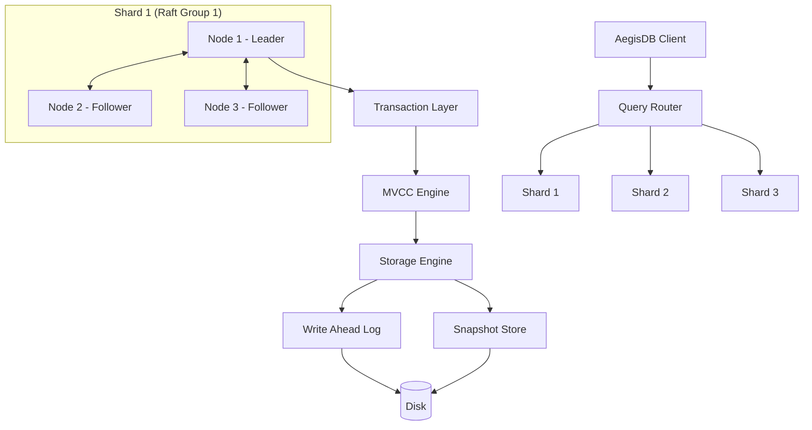

# AegisDB Arkitektur

> **A Fault Tolerant Distributed Transactional Database Engine in Java**

---

## 1. Systemöversikt

AegisDB är en distribuerad, feltolerant transaktionsdatabas skriven från grunden i Java (Java 25 LTS). Systemet bygger på Raft-konsensus för stark konsistens och replikering, kombinerat med Write-Ahead Logging (WAL) och snapshotting för persistent lagring och kraschåterställning, samt MVCC (Multi-Version Concurrency Control) och Two-Phase Commit (2PC) för distribuerade transaktioner.



---

## 2. Grundläggande Arkitekturregler

Följande separationer är obligatoriska i systemdesignen:

1. **Transport vs Consensus:**
   Raft känner aldrig till om RPC sker över gRPC, HTTP/2 eller ett internt minnesnätverk (`InMemoryTransport`). Allt sker via gränssnittet `RaftTransport`.
2. **Lagring vs Transport:**
   Lagringsmotorn (`StorageEngine` och `WalManager`) känner inte till gRPC eller nätverk.
3. **Core vs Framework:**
   Datakärnan (Raft, WAL, MVCC, Transactions) har noll beroenden till Spring. Spring Boot används uteslutande i `aegisdb_management` för administrations- och hälso-API:er.

---

## 3. Modulstruktur

```text
AegisDB/
├── pom.xml                   # Root Parent POM (Java 25, gRPC, Protobuf, JUnit 5)
├── README.md                 # Projektdokumentation & instruktioner
├── LICENSE                   # MIT License
├── docker/                   # Docker- och container-konfigurationer
├── docs/                     # Arkitektur, garantier & felmodeller
├── scripts/                  # Bygg- och klusterstartskript
├── experiments/              # Benchmarks & forskningsresultat
│
├── aegisdb_common/           # Domänmodeller (NodeId, Endpoint, NodeStatus, Configs)
├── aegisdb_protocol/         # Protobuf-kontrakt & gRPC RPC-definitioner
├── aegisdb_transport/        # GrpcRaftTransport & InMemoryTransport
├── aegisdb_node/             # DatabaseNode, NodeBootstrap & NodeLifecycle
├── aegisdb_integration/      # 3-nods klustertester & verifieringsdemos
├── aegisdb_raft/             # (Sprint 2-3) Raft Consensus & Election
├── aegisdb_storage/          # (Sprint 4-5) StorageEngine, WAL & Snapshots
├── aegisdb_mvcc/             # (Sprint 6) Multi-Version Concurrency Control
├── aegisdb_transaction/      # (Sprint 7) Transaktionshantering & isolering
├── aegisdb_sharding/         # (Sprint 8) HashPartitioner, ShardMap & Routing
├── aegisdb_client/           # (Sprint 9) Klientbibliotek & Leader Redirect
├── aegisdb_management/       # Management API & hälsoendpoints (Spring Boot)
├── aegisdb_observability/    # OpenTelemetry & Prometheus-mätvärden
├── aegisdb_chaos/            # Fault injection & nätverkspartitioner
└── aegisdb_benchmark/        # Latency- & genomströmnings-benchmarks
```
