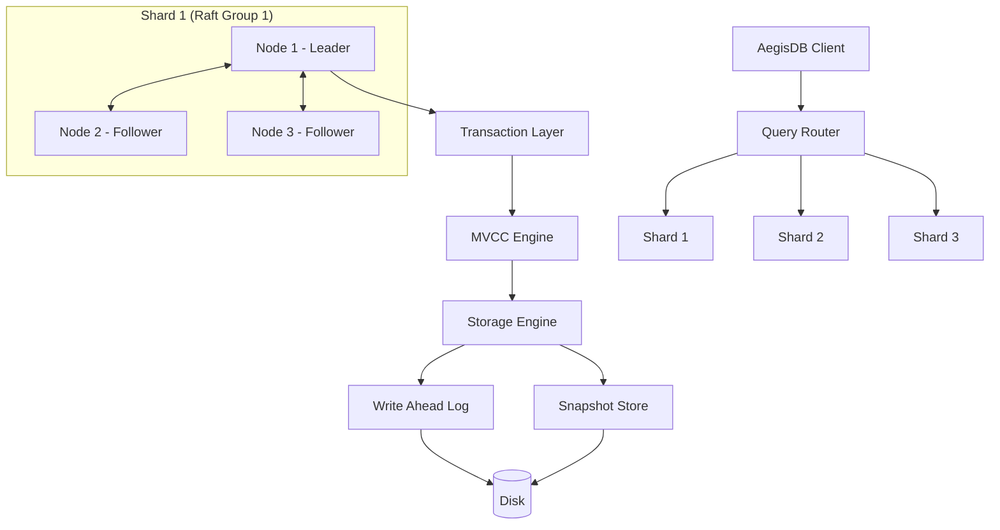

# AegisDB Architecture

> **A Fault-Tolerant Distributed Transactional Database Engine in Java**

---

## 1. System Overview

AegisDB is a distributed, fault-tolerant transactional database written from the ground up in Java (Java 25 LTS). The system is built on Raft consensus for strong consistency and replication, combined with Write-Ahead Logging (WAL) and snapshotting for persistent storage and crash recovery, as well as MVCC (Multi-Version Concurrency Control) and Two-Phase Commit (2PC) for distributed transactions.



---

## 2. Core Architectural Rules

The following layer boundaries are mandatory in the system design:

1. **Transport vs. Consensus:**
   Raft is entirely transport-agnostic and does not know whether RPC occurs over gRPC, HTTP/2, or an in-memory network (`InMemoryTransport`). All communication flows through the abstract `RaftTransport` interface.
2. **Storage vs. Transport:**
   The storage engine (`StorageEngine` and `WalManager`) has zero coupling to gRPC or network layers.
3. **Core vs. Framework:**
   The data engine core (Raft, WAL, MVCC, Transactions) maintains zero dependencies on Spring. Spring Boot is used exclusively in `aegisdb_management` for external administration and health APIs.

---

## 3. Module Structure

```text
AegisDB/
├── pom.xml                   # Root Parent POM (Java 25, gRPC, Protobuf, JUnit 5)
├── README.md                 # Project documentation & instructions
├── LICENSE                   # MIT License
├── docker/                   # Docker and container configurations
├── docs/                     # Architecture, guarantees & failure models
├── scripts/                  # Build, test, and live demonstration scripts
├── experiments/              # Benchmarks & research experiments
│
├── aegisdb_common/           # Domain models (NodeId, Endpoint, NodeStatus, TransactionId, ClientId, RequestId)
├── aegisdb_protocol/         # Protobuf contracts & gRPC RPC definitions
├── aegisdb_transport/        # GrpcRaftTransport & InMemoryTransport
├── aegisdb_node/             # DatabaseNode, NodeBootstrap & NodeLifecycle
├── aegisdb_integration/      # 3-node cluster tests & verification demos
├── aegisdb_raft/             # Raft Consensus, Election, Replication & Snapshots
├── aegisdb_storage/          # StorageEngine, WAL, CRC32 & Snapshots
├── aegisdb_client/           # Java SDK Client & Leader Redirect
├── aegisdb_mvcc/             # Multi-Version Concurrency Control (MvccStore, Snapshots, VersionChains)
├── aegisdb_transaction/      # Single-shard transactions, isolation levels, validation, conflict detection & durable logging
├── aegisdb_sharding/         # HashPartitioner, ShardMap & Routing
├── aegisdb_management/       # Management API & health endpoints (Spring Boot)
├── aegisdb_observability/    # OpenTelemetry & Prometheus metrics
├── aegisdb_chaos/            # Fault injection & network partition testing
└── aegisdb_benchmark/        # Latency & throughput benchmarks
```

---

## 4. Transaction & Concurrency Architecture

The `aegisdb_transaction` module provides atomic, single-shard ACID transactions with Snapshot Isolation (SI) and Serializable Snapshot Isolation (SSI):

- **Decoupled Architecture:** Zero coupling to transport, network, gRPC, or Spring frameworks. Depends solely on `aegisdb_common` and `aegisdb_mvcc`.
- **4-State Lifecycle:** Explicit state machine enforcing `ACTIVE -> PREPARING -> PREPARED -> COMMITTED` and `ACTIVE/PREPARING/PREPARED -> ABORTED`.
- **Isolation Modes:**
  - *Snapshot Isolation (SI):* Readers observe a consistent snapshot; concurrent writers detect collisions via First-Committer-Wins.
  - *Serializable Snapshot Isolation (SSI):* Tracks read-sets to detect and reject anti-dependency anomalies (such as write skew).
- **Durability & Recovery:** `DurableTransactionLog` guarantees crash safety using binary framing with magic headers (`0xAE615D70`), CRC32 checksums, and torn-write truncation.
- **Idempotency & Limits:** Deduplicates client requests via `(ClientId, RequestId)` and prevents resource starvation via configurable write-set bounds and TTL expiration.

