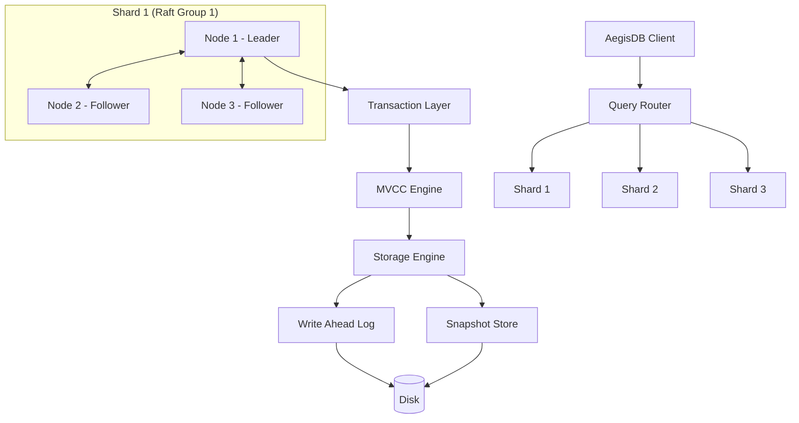
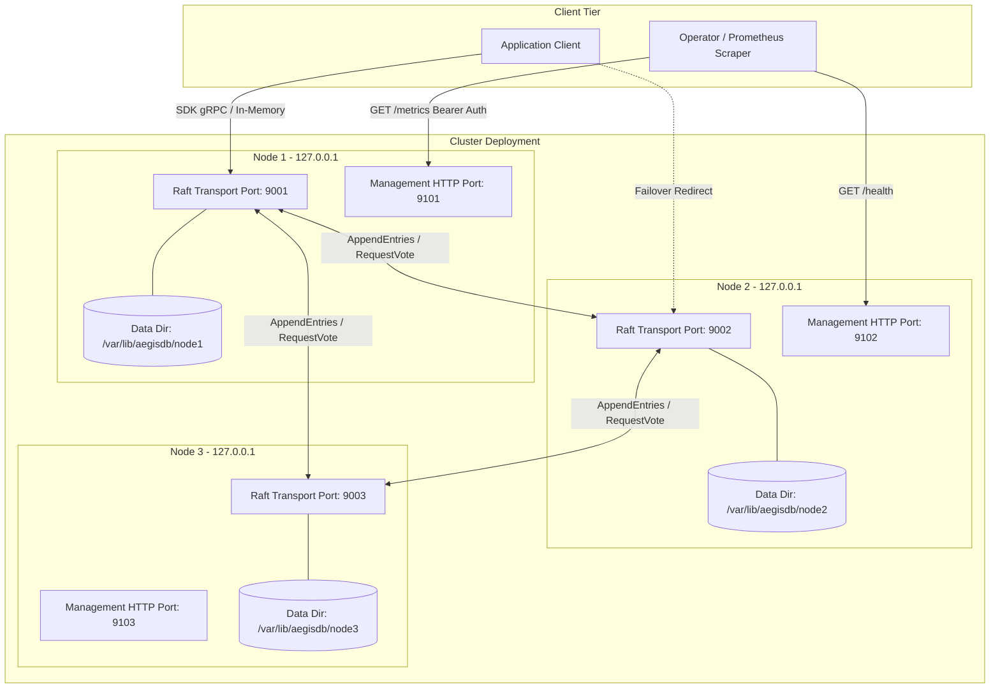
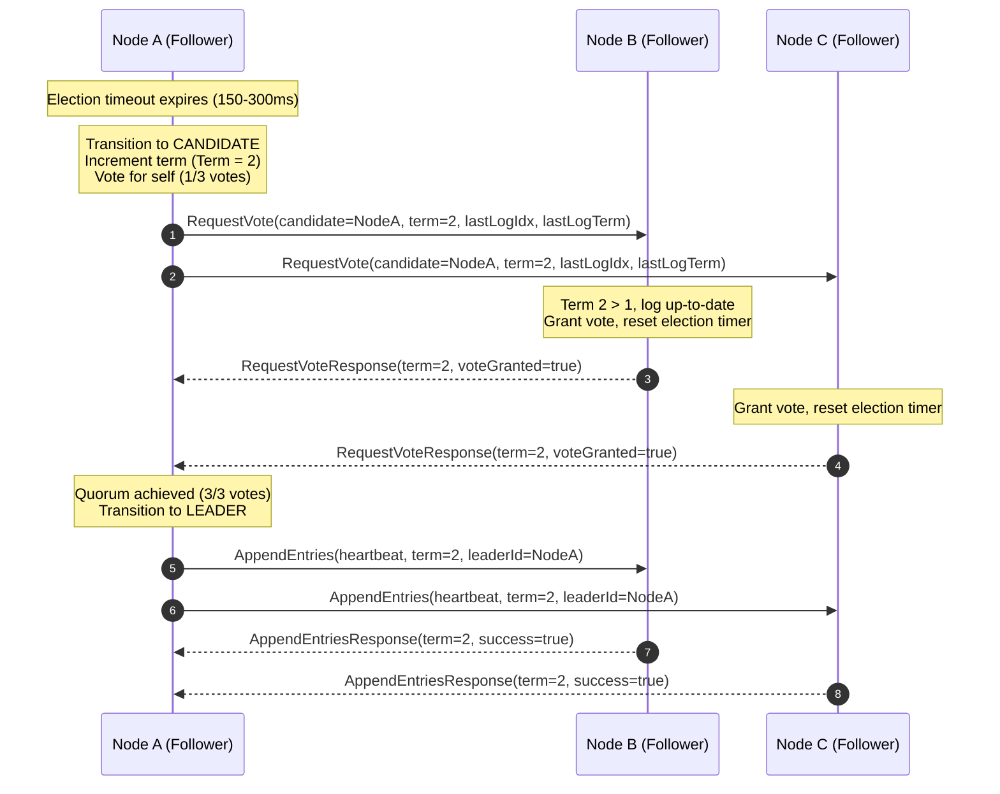
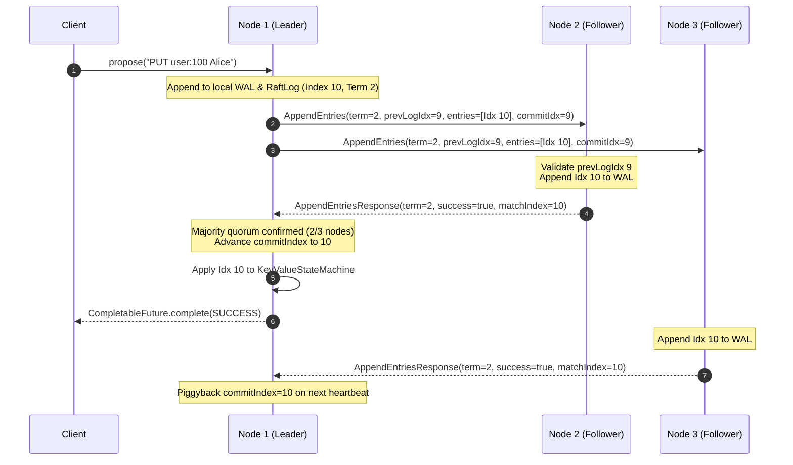
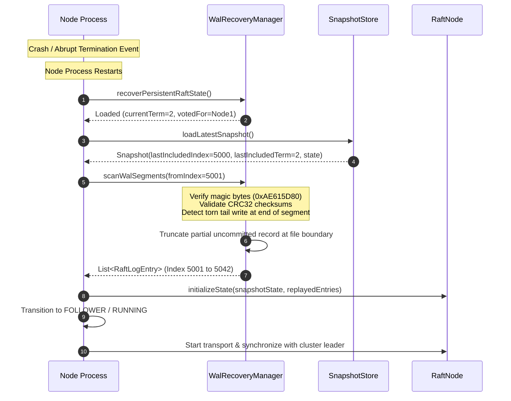
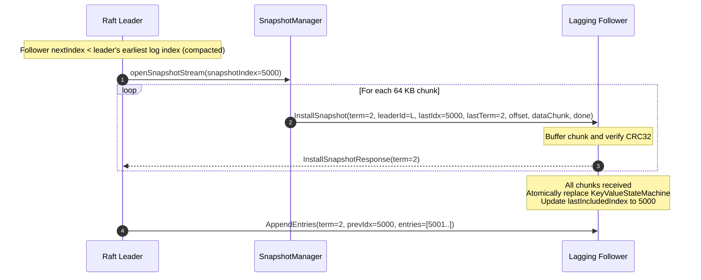
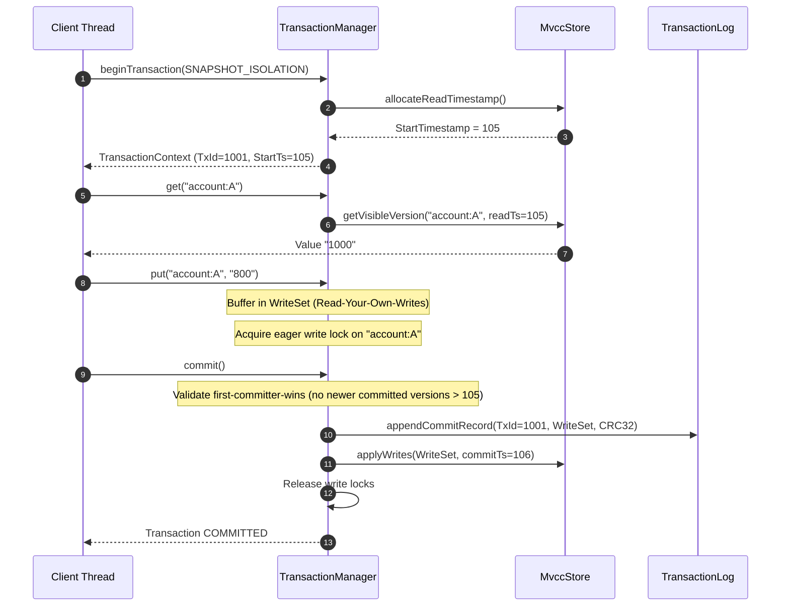
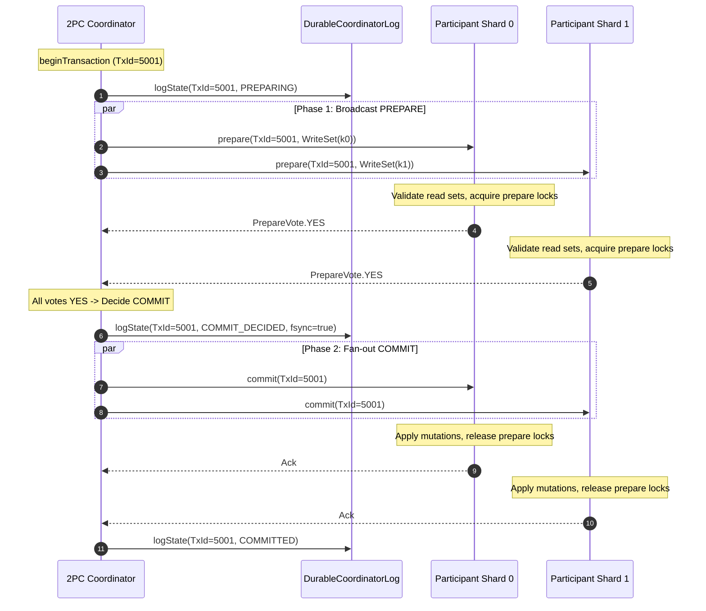

# AegisDB Architecture

> **A Fault-Tolerant Distributed Transactional Database Engine in Java**

---

## 1. System Overview

AegisDB is a distributed, fault-tolerant transactional database written from the ground up in Java (Java 25 LTS). The system is built on Raft consensus for strong consistency and replication, combined with Write-Ahead Logging (WAL) and snapshotting for persistent storage and crash recovery, as well as MVCC (Multi-Version Concurrency Control) and Two-Phase Commit (2PC) for distributed transactions.



---

## 2. Core Architectural Rules

The following layer boundaries are mandatory in the system design:

1. **Transport vs. Consensus:**
   Raft is entirely transport-agnostic and does not know whether RPC occurs over gRPC, HTTP/2, or an in-memory network (`InMemoryTransport`). All communication flows through the abstract `RaftTransport` interface.
2. **Storage vs. Transport:**
   The storage engine (`StorageEngine` and `WalManager`) has zero coupling to gRPC or network layers.
3. **Core vs. Framework:**
   The data engine core (Raft, WAL, MVCC, Transactions) maintains zero dependencies on Spring. Spring Boot is used exclusively in `aegisdb_management` for external administration and health APIs.

---

## 3. Module Structure

```text
AegisDB/
├── pom.xml                   # Root Parent POM (Java 25, gRPC, Protobuf, JUnit 5)
├── README.md                 # Project documentation & instructions
├── LICENSE                   # MIT License
├── docker/                   # Docker and container configurations
├── docs/                     # Architecture, guarantees & failure models
├── scripts/                  # Build, test, and live demonstration scripts
├── experiments/              # Benchmarks & research experiments
│
├── aegisdb_common/           # Domain models (NodeId, Endpoint, NodeStatus, TransactionId, ClientId, RequestId)
├── aegisdb_protocol/         # Protobuf contracts & gRPC RPC definitions
├── aegisdb_transport/        # GrpcRaftTransport & InMemoryTransport
├── aegisdb_node/             # DatabaseNode, NodeBootstrap & NodeLifecycle
├── aegisdb_integration/      # 3-node cluster tests & verification demos
├── aegisdb_raft/             # Raft Consensus, Election, Replication & Snapshots
├── aegisdb_storage/          # StorageEngine, WAL, CRC32 & Snapshots
├── aegisdb_client/           # Java SDK Client & Leader Redirect
├── aegisdb_mvcc/             # Multi-Version Concurrency Control (MvccStore, Snapshots, VersionChains)
├── aegisdb_transaction/      # Single-shard transactions, isolation levels, validation, conflict detection & durable logging
├── aegisdb_sharding/         # HashPartitioner, ShardMap & Routing
├── aegisdb_management/       # Lightweight REST Management API, RBAC Bearer Token Auth & Security Guardrails
├── aegisdb_observability/    # OpenTelemetry & Prometheus metrics
├── aegisdb_chaos/            # Fault injection, network partition & continuous invariant testing
└── aegisdb_benchmark/        # Latency & throughput benchmarks
```

---

## 4. Transaction & Concurrency Architecture

The `aegisdb_transaction` module provides atomic, single-shard ACID transactions with Snapshot Isolation (SI) and Serializable Snapshot Isolation (SSI):

- **Decoupled Architecture:** Zero coupling to transport, network, gRPC, or Spring frameworks. Depends solely on `aegisdb_common` and `aegisdb_mvcc`.
- **4-State Lifecycle:** Explicit state machine enforcing `ACTIVE -> PREPARING -> PREPARED -> COMMITTED` and `ACTIVE/PREPARING/PREPARED -> ABORTED`.
- **Isolation Modes:**
  - *Snapshot Isolation (SI):* Readers observe a consistent snapshot; concurrent writers detect collisions via First-Committer-Wins.
  - *Serializable Snapshot Isolation (SSI):* Tracks read-sets to detect and reject anti-dependency anomalies (such as write skew).
- **Durability & Recovery:** `DurableTransactionLog` guarantees crash safety using binary framing with magic headers (`0xAE615D70`), CRC32 checksums, and torn-write truncation.
- **Idempotency & Limits:** Deduplicates client requests via `(ClientId, RequestId)` and prevents resource starvation via configurable write-set bounds and TTL expiration.

---

## 5. Multi-Raft Sharding & Query Routing Architecture

Phase 8 introduces horizontal sharding and dynamic query routing via Multi-Raft consensus groups:

- **MurmurHash3 Partitioning:** Pure-Java 32-bit MurmurHash3 algorithm deterministically maps keys across shards ($\text{floorMod}(\text{hash}(\text{key}), \text{shardCount})$) with uniform distribution ($\pm 5\%$ deviation).
- **Replication Groups:** Each shard operates as an independent Raft consensus group (`ReplicationGroup`) maintaining isolated logs, terms, and state machines.
- **Fault Isolation:** Leader election, network splits, or slow followers in Shard A have zero operational impact on Shard B.
- **Dynamic Leader Caching:** `LeaderLocator` maintains cached mappings of active shard leaders, intercepting redirect hints and invalidating stale routes on consensus transitions.
- **Client Transparency:** `ShardedAegisDbClient` intercepts single-key and multi-shard operations, routing them transparently to the appropriate shard leader with backoff retry logic.

---

## 6. Distributed Transactions & Two-Phase Commit (2PC) Architecture

Phase 9 establishes atomic cross-shard distributed transactions (Milestone M4 Gate):

- **2PC State Machine:** Explicit transitions (`INIT -> PREPARING -> COMMIT_DECIDED / ABORT_DECIDED -> COMMITTED / ABORTED`) enforced by `DistributedTransactionCoordinator`.
- **Durable Coordinator WAL:** Decisions are durably appended to disk via `DurableCoordinatorLog` using binary framing (`0xAE6120C0` magic header, CRC32 checksums, and synchronous `fsync`).
- **In-Doubt Safety & Prepare Locks:** Shard participants acquire key-level prepare locks during the in-doubt window. No participant commits or aborts unilaterally without coordinator instruction.
- **8-Scenario Crash Recovery Matrix:** `DistributedTransactionRecovery` replays the coordinator log on startup, resolving transactions across all coordinator and participant crash permutations.
- **Optimistic Concurrency Control (OCC):** Read sets are validated at prepare time to ensure serializable execution and eliminate write skew or lost updates across shards.

---

## 7. Chaos Engineering & Security Hardening Architecture

Phase 10 introduces systematic fault injection, continuous safety assertion, and management plane hardening:

- **Composable Fault Injection (`FaultyTransport`):** Decorates the abstract `RaftTransport` layer to introduce deterministic packet drops, latency jitter, duplications, and network partitions without touching core consensus algorithms.
- **Cluster Orchestration (`ChaosOrchestrator`):** Simulates leader kills, follower crashes, split-brain majority/minority partitions, and dynamic network healing.
- **Continuous Invariant Verification (`ChaosInvariantMonitor`):** Concurrently asserts that election safety (at most one leader per term), monotonic terms, log prefix equality, and cross-shard financial balance conservation ($A + B + C = 3000$) remain strictly intact under continuous chaos.
- **Management Plane & RBAC (`ManagementHttpServer`):** Lightweight JDK `HttpServer` with Java 25 virtual threads exposing operational diagnostics. Protected by constant-time Bearer token verification (`MessageDigest.isEqual`) defending against side-channel timing attacks.
- **Security Guardrails:**
  - Key size bounded to $\le 1\text{ KB}$ and payload size bounded to $\le 16\text{ MB}$.
  - Token-bucket rate limiting against Denial-of-Service (DoS).
  - Path traversal sanitization preventing directory escape vulnerabilities.
- **Architectural Rules:** ArchUnit tests (`ChaosArchitectureTest`, `ManagementArchitectureTest`) enforce zero coupling between the consensus/storage/transaction core and the chaos/management subsystems.

---

## 8. Master Architectural Diagrams (Master Plan §25)

The following sequence, deployment, and behavioral diagrams fulfill the formal documentation deliverables required by **Master Project Plan §25**:

### 8.1 Deployment Architecture Diagram


---

### 8.2 Leader Election Sequence Diagram


---

### 8.3 Write Replication Sequence Diagram


---

### 8.4 Crash Recovery Sequence Diagram


---

### 8.5 Snapshot Installation Sequence Diagram


---

### 8.6 Local MVCC Transaction Sequence Diagram


---

### 8.7 Distributed Transaction (2PC) Sequence Diagram


---

### 8.8 Network Partition & Split-Brain Mitigation Diagram
```mermaid
flowchart TD
    subgraph "Majority Partition (Quorum = 2/3)"
        L1[Node 1 - Active Leader (Term 1)]
        F2[Node 2 - Follower (Term 1)]
        L1 <-->|Heartbeats & Log Replication| F2
        ClientA[Client Traffic] -->|Writes Confirmed| L1
    end

    subgraph "Network Partition Barrier"
        Barrier[X - Inter-node RPCs Blocked - X]
    end

    subgraph "Minority Partition (Quorum = 1/3)"
        F3[Node 3 - Isolated Node]
        F3 -.->|Election timeout fires<br/>Cannot achieve majority| Cand3[Candidate (Term 2)]
        ClientB[Isolated Client Traffic] -.->|Writes BLOCKED / Rejected| F3
    end

    L1 -.->|Blocked| Barrier
    F2 -.->|Blocked| Barrier
    Barrier -.->|Blocked| F3

    classDef majority fill:#d4edda,stroke:#28a745,stroke-width:2px;
    classDef minority fill:#f8d7da,stroke:#dc3545,stroke-width:2px;
    class L1,F2,ClientA majority;
    class F3,Cand3,ClientB minority;
```
