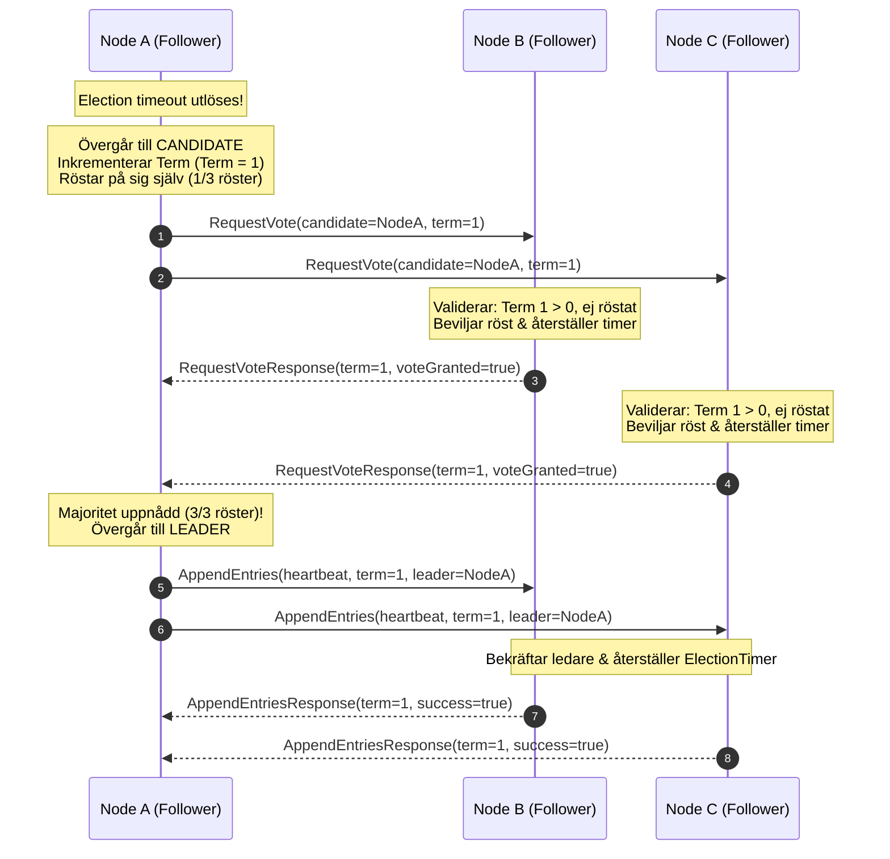
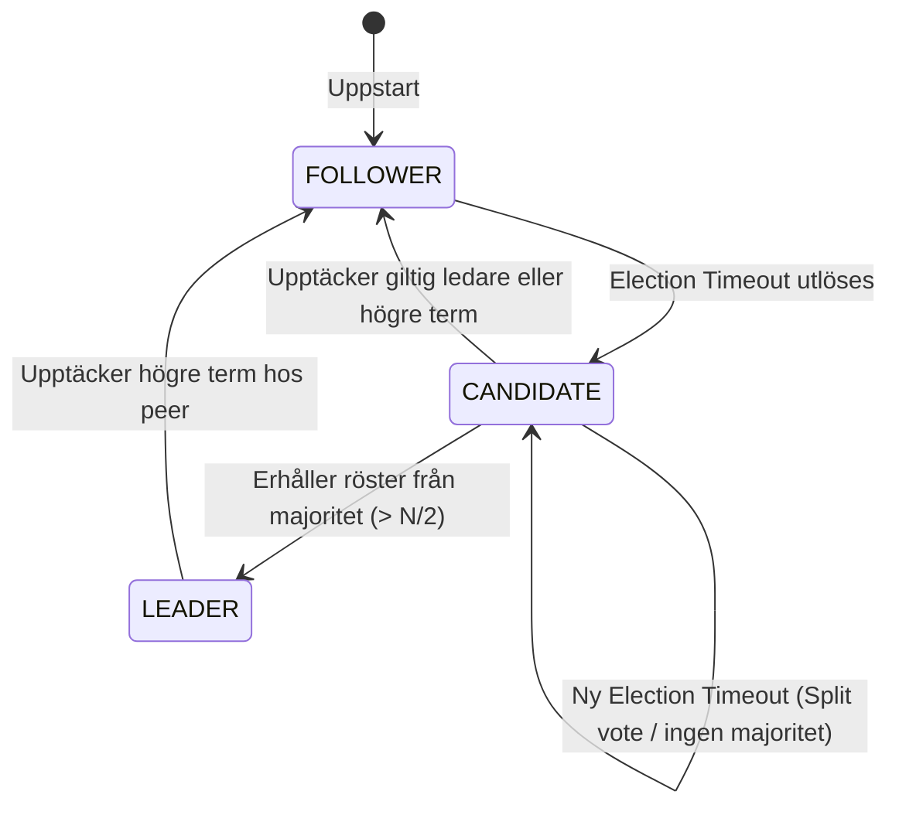

# AegisDB Raft Konsensus & Ledarval (Leader Election)

---

## 1. Översikt

Modulen `aegisdb_raft` implementerar Raft-konsensusprotokollet för ledarval (Sprint 2) och loggreplikering (Sprint 3). Den garanterar stark konsistens och feltolerans genom följande egenskaper:
- **Exakt en ledare per term:** Endast en nod kan vinna valet i en given term ($> N/2$ röster).
- **Automatiskt omval vid fel:** Om en ledare kraschar eller nätverket partitioneras upptäcker följarna timeout och väljer en ny ledare.
- **Deterministiskt testbar:** Genom `Clock` och `Scheduler`-abstraktioner kan alla val och feltoleransscenarier testas deterministiskt utan slumpmässiga fördröjningar.

---

## 2. Leader Election Sekvensdiagram (Sektion 125)

Nedanstående sekvensdiagram illustrerar ett normalt ledarval i ett 3-noders kluster:

---

## 3. Tillståndsmaskin för Roller

---

## 4. Invarianter som aldrig får brytas (Sektion 20 & 75)

1. **At most one leader per term:** Högst en ledare får någonsin väljas i en given term.
2. **Terms never decrease:** En nods term får aldrig minska i värde.
3. **At most one vote per term:** En nod röstar högst en gång per term.
