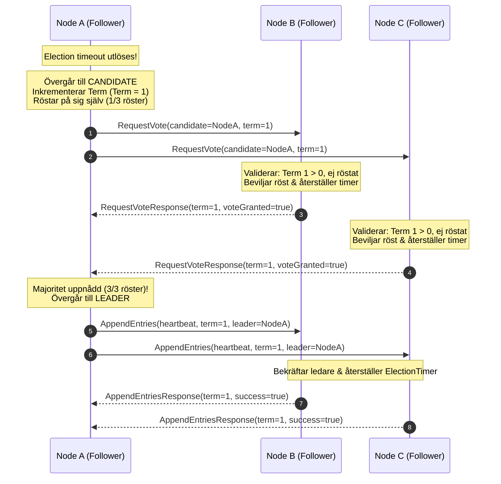
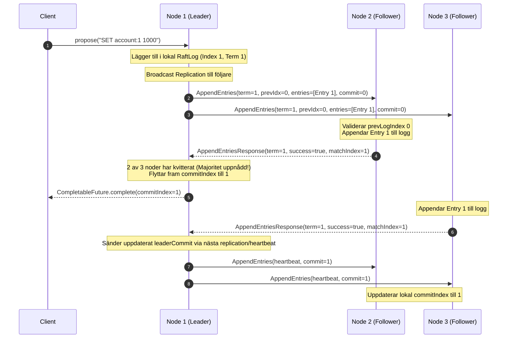
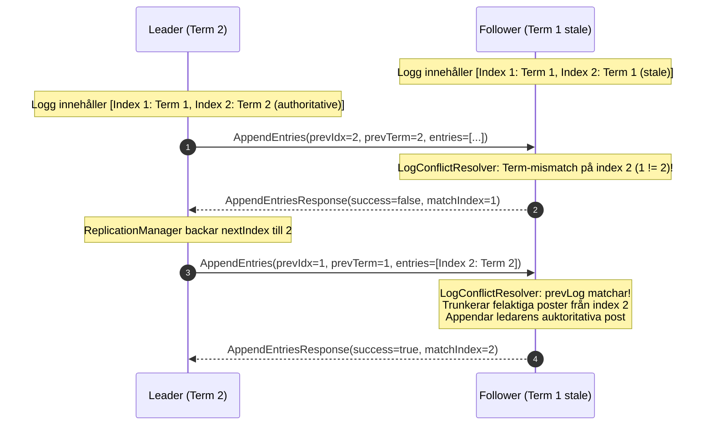
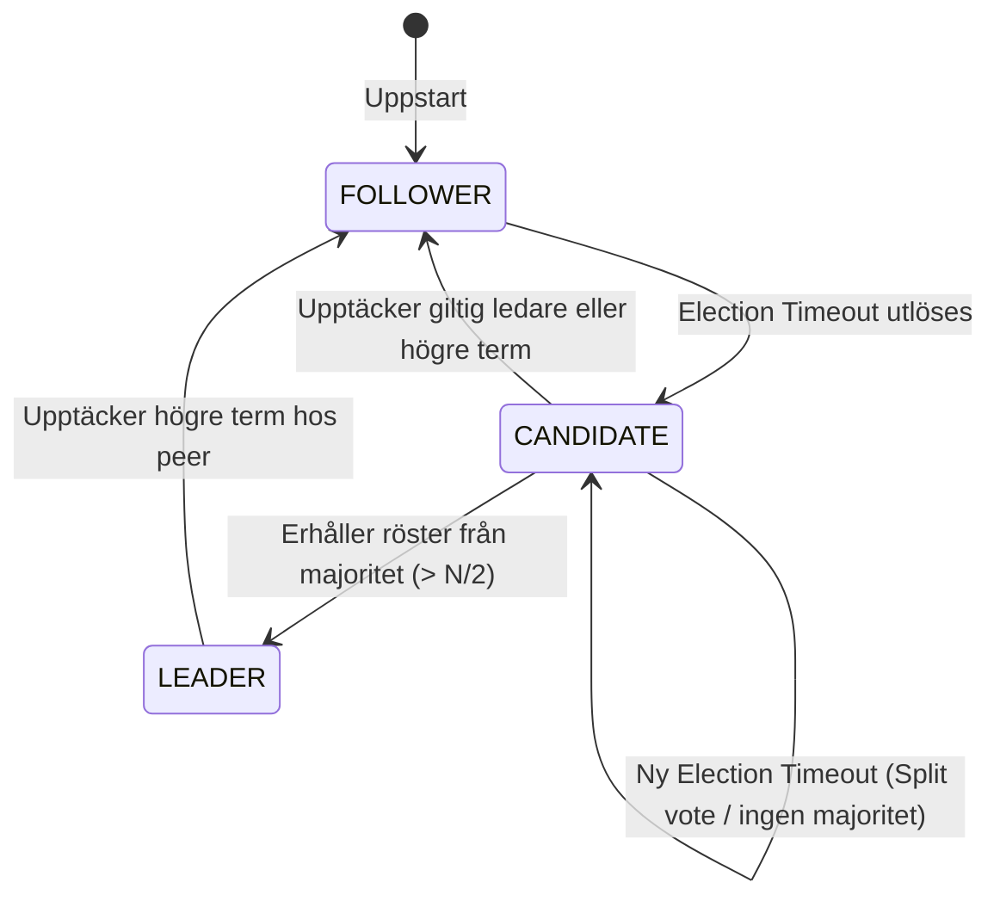

# AegisDB Raft Konsensus: Ledarval & Loggreplikering

---

## 1. Översikt

Modulen `aegisdb_raft` implementerar Raft-konsensusprotokollet i Java 25 i enlighet med Ongaro & Ousterhout (§5.1, §5.2, §5.3, §5.4) och kursspecifikationen (Sektion 18, 20, 21, 22, 23, 24, 75, 82, 83 och 107).

Den garanterar stark konsistens och feltolerans genom:
- **Exakt en ledare per term:** Endast en nod kan vinna valet i en given term ($> N/2$ röster).
- **Automatiskt omval vid fel:** Om en ledare kraschar eller nätverket partitioneras upptäcker följarna timeout och väljer en ny ledare.
- **Majoritetsreplikering:** Klientskrivningar committas först när en strikt majoritet ($N/2 + 1$) av noderna har bekräftat posten.
- **Loggkonsistens & konfliktlösning:** Om en följare har divergerande, ocommittade poster trunkeras dessa och ersätts med ledarens auktoritativa poster.
- **Deterministiskt testbar:** Genom `Clock` och `Scheduler`-abstraktioner kan alla val och feltoleransscenarier testas deterministiskt utan slumpmässiga fördröjningar.

---

## 2. Leader Election Sekvensdiagram (Sektion 125, US005)

Nedanstående sekvensdiagram illustrerar ett normalt ledarval i ett 3-noders kluster:

---

## 3. Log Replication Sekvensdiagram (US006)

Klientpropositionsflöde med majoritetskvittering och framflyttning av commit-index:

---

## 4. Log Conflict Resolution (Ongaro §5.3)

Om en följare har divergerande poster från en tidigare term som aldrig committades:

---

## 5. Tillståndsmaskin för Roller

---

## 6. Invarianter som aldrig får brytas (Sektion 20 & 75)

1. **At most one leader per term:** Högst en ledare får någonsin väljas i en given term.
2. **Terms never decrease:** En nods term får aldrig minska i värde.
3. **At most one vote per term:** En nod röstar högst en gång per term.
4. **Committed entries are never overwritten:** En post som har committats av en majoritet får aldrig trunkeras eller skrivas över.
5. **Committed entries appear in identical order:** Samtliga klusternoder har identisk sekvens av poster upp till commit-index.
