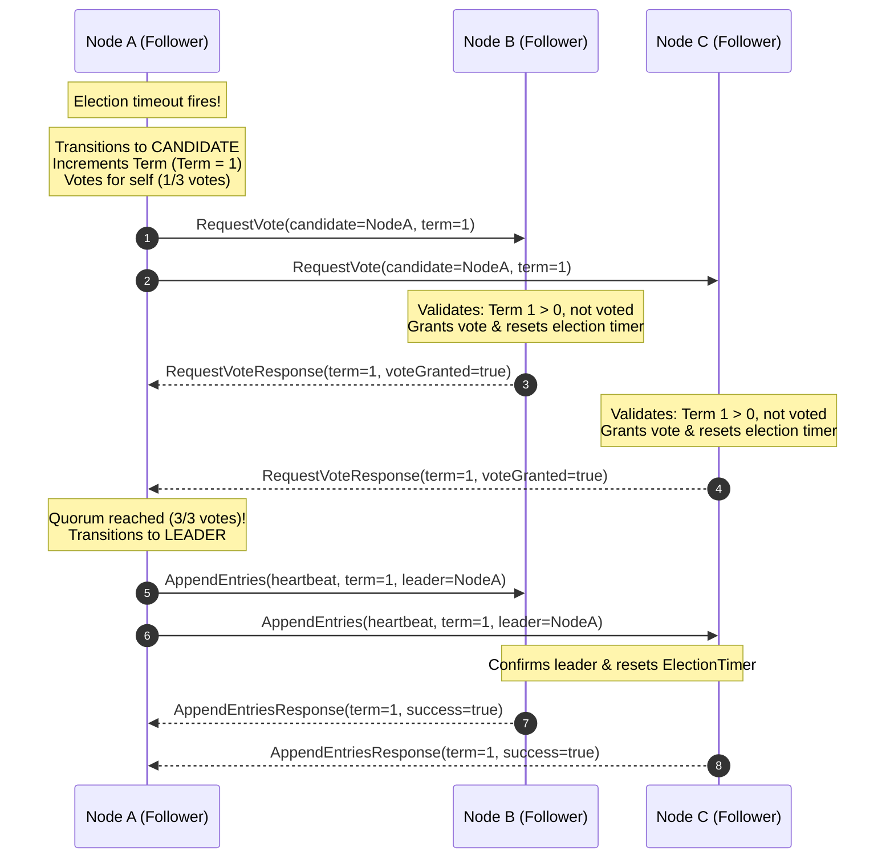
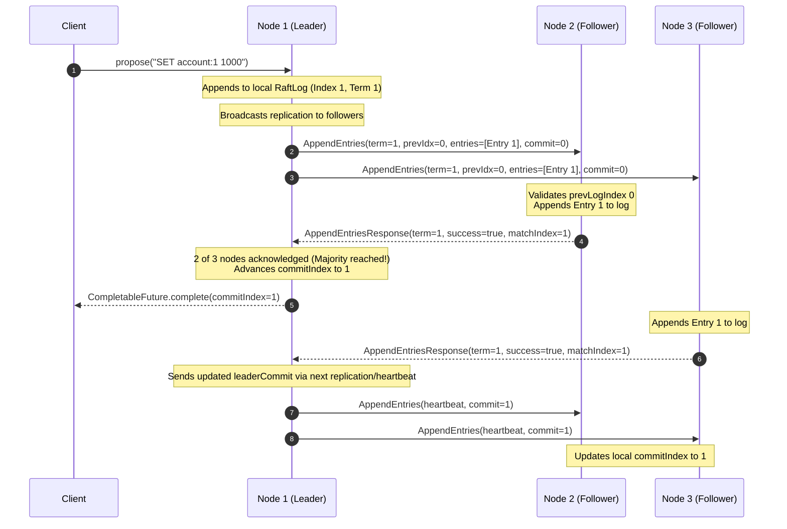
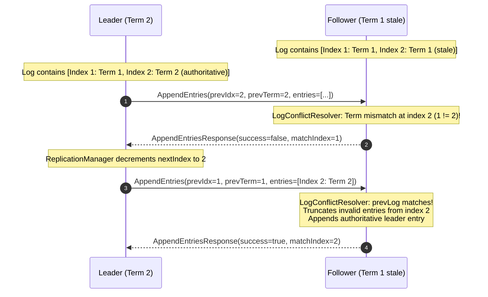
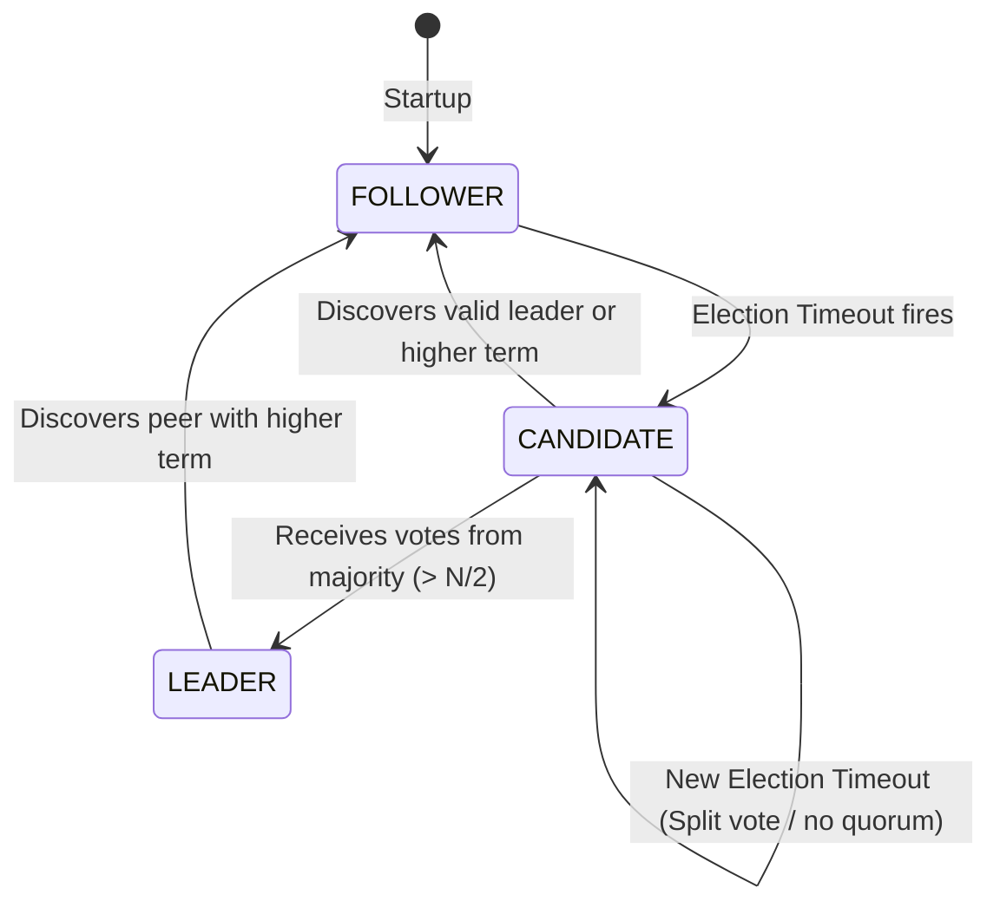

# AegisDB Raft Consensus: Leader Election & Log Replication

---

## 1. Overview

The `aegisdb-raft` module implements the Raft consensus protocol in Java 21 in accordance with Ongaro & Ousterhout (§5.1, §5.2, §5.3, §5.4) and the course specification (Sections 18, 20, 21, 22, 23, 24, 75, 82, 83, and 107).

It guarantees strong consistency and fault tolerance through:
- **Exactly one leader per term:** Only one node can win the election in any given term ($> N/2$ votes).
- **Automatic failover:** If a leader crashes or the network partitions, followers detect timeout and safely elect a new leader.
- **Majority replication:** Client writes are committed only after a strict majority ($N/2 + 1$) of nodes acknowledge the entry.
- **Log consistency & conflict repair:** If a follower has diverging, uncommitted entries, they are automatically truncated and replaced with authoritative leader entries.
- **Deterministically testable:** Through `Clock` and `Scheduler` abstractions, all elections and fault scenarios are testable deterministically without unpredictable sleeps.

---

## 2. Leader Election Sequence Diagram (Section 125, US005)

The sequence diagram below illustrates a normal leader election in a 3-node cluster:

---

## 3. Log Replication Sequence Diagram (US006)

Client proposal workflow with majority acknowledgment and commit index advancement:

---

## 4. Log Conflict Resolution (Ongaro §5.3)

Handling a follower with diverging, uncommitted entries from a previous term:

---

## 5. Node Role State Machine

---

## 6. Strict Raft Invariants (Sections 20 & 75)

1. **At most one leader per term:** At most one leader may ever be elected in any given term.
2. **Terms never decrease:** A node's term must never decrease in value.
3. **At most one vote per term:** A node votes at most once per term.
4. **Committed entries are never overwritten:** An entry committed by a majority must never be truncated or overwritten.
5. **Committed entries appear in identical order:** All cluster nodes share an identical sequence of committed entries up to commit-index.
