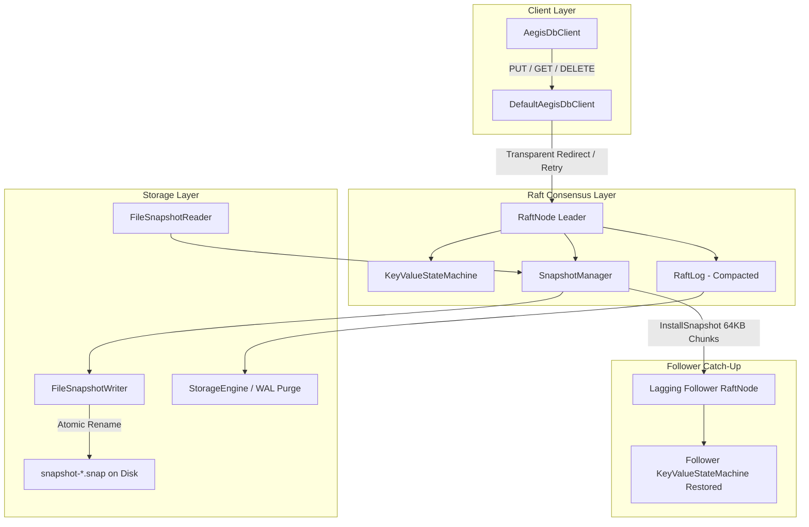

# AegisDB Snapshots & Replicated Key-Value Store

> **Log Compaction, Point-in-Time Checkpointing, InstallSnapshot RPC, and Replicated KV State Machine**
> Sprint 5 Deliverable (US009 & US010; Milestone M2 Gate)

---

## 1. Overview & Architecture

In accordance with Raft §7 and Section 8 of the Master Project Plan, `AegisDB` implements point-in-time state machine snapshotting and log compaction so that the consensus write-ahead log (WAL) does not grow without bound.

### Key Capabilities
- **Bounded Disk Footprint**: Commits prior to `lastIncludedIndex` are compacted from memory and disk.
- **Fast Crash Recovery**: Restores state machine directly from the latest snapshot and replays only subsequent WAL entries.
- **Follower Catch-up via `InstallSnapshot`**: Disconnected or slow followers whose log entries have been compacted are brought up to date via chunked snapshot transfer.
- **Client SDK (`aegisdb_client`)**: Seamless client interactions with automatic leader discovery, transparent redirects on `NotLeaderException`, and exponential backoff retry.
- **Milestone M2 Gate**: Proven 3-node replicated cluster that survives leader crashes and node restarts without data loss.



---

## 2. Snapshot Binary Framing & Checksum

Snapshot files are persisted in `<dataDir>/snapshots/` with deterministic naming:
`snapshot-%020d-%020d.snap` (`lastIncludedIndex`-`lastIncludedTerm`).

| Field | Size | Type | Description |
|---|---|---|---|
| **Magic Number** | 4 bytes | `int` (`0xAE615DA2`) | Format identifier for AegisDB snapshots |
| **Format Version** | 2 bytes | `short` (`1`) | Format evolution version |
| **Last Included Index** | 8 bytes | `long` | Raft LogIndex up to which the snapshot covers |
| **Last Included Term** | 8 bytes | `long` | Raft term of `lastIncludedIndex` |
| **CRC32 Checksum** | 4 bytes | `unsigned int` | Checksum computed over payload data |
| **Payload Length** | 4 bytes | `int` | Bounded length prefix (up to 64 MB) |
| **State Data** | variable | `byte[]` | State machine serialized state |

### Atomic Persistence & Retention
- **Atomic Move**: Files are written to `<filename>.tmp`, synced with `FileChannel.force(true)`, and atomically moved to `.snap` via `Files.move(..., ATOMIC_MOVE, REPLACE_EXISTING)`.
- **Retention Policy**: Keeps the 2 most recent valid snapshot files and safely prunes older files to bound disk space.

---

## 3. InstallSnapshot RPC Specification

When a follower's `nextIndex <= raftLog.snapshotIndex()`, the leader cannot replicate missing entries using `AppendEntries`. It invokes the `InstallSnapshot` RPC (Raft §7):

```protobuf
message InstallSnapshotArgs {
  int64 term = 1;
  string leader_id = 2;
  int64 last_included_index = 3;
  int64 last_included_term = 4;
  int64 offset = 5;
  bytes data = 6;
  bool done = 7;
}

message InstallSnapshotReply {
  int64 term = 1;
  bool success = 2;
}
```

- **Chunk Size**: Transferred in 64 KB chunks.
- **Assembly**: Follower accumulates incoming chunks in a buffer. When `done = true`, follower validates CRC32 checksum and invokes `stateMachine.restoreSnapshot(...)`.

---

## 4. Replicated Key-Value State Machine

`KeyValueStateMachine` provides thread-safe, deterministically ordered key-value storage:
- **Underlying Store**: `ConcurrentSkipListMap<String, byte[]>` ensuring stable lexicographical key order.
- **Operations**:
  - `PUT`: inserts/updates key-value mapping.
  - `GET`: reads latest committed value.
  - `DELETE`: removes key mapping.
- **Serialization Format**: UTF-8 key length, key bytes, value length, value bytes.

---

## 5. Client Java SDK (`aegisdb_client`)

Applications interface with AegisDB through `aegisdb_client`:
```java
AegisDbClient client = DefaultAegisDbClient.forNodes(clusterNodes);

// Write
client.putString("user:1001", "Alice").get(5, TimeUnit.SECONDS);

// Read
Optional<String> user = client.getString("user:1001").get(5, TimeUnit.SECONDS);

// Delete
client.delete("user:1001").get(5, TimeUnit.SECONDS);
```

### Leader Discovery & Transparent Failover
- Tracks known `currentLeader`.
- Upon `NotLeaderException(redirectLeader, term)`, immediately updates candidate leader.
- Automatically retries with exponential backoff on transient errors or node crashes.
