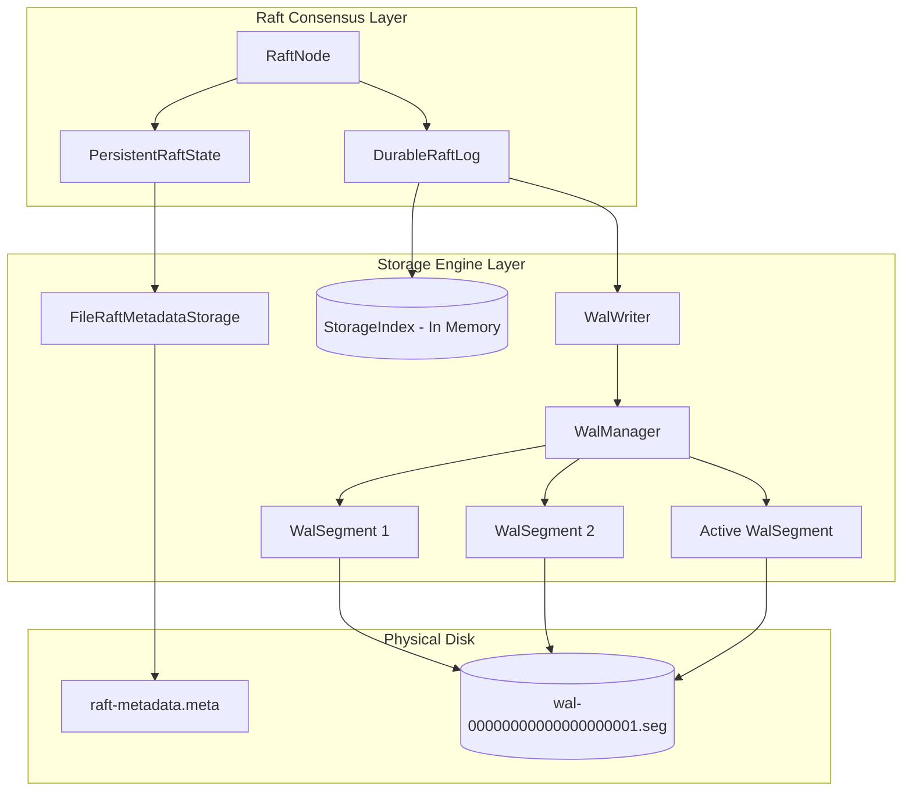
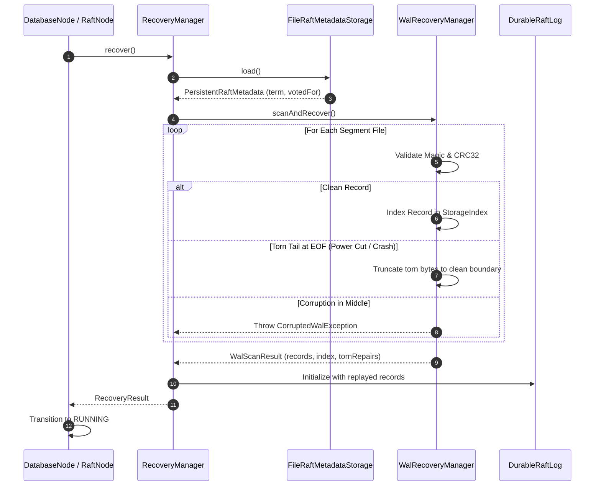

# AegisDB Storage & Durability Engine

> **Durable Write-Ahead Logging (WAL), Consensus Metadata Persistence, and Crash Recovery**
> Sprint 4 Deliverable (US007 & US008)

---

## 1. Overview & Architecture

The `aegisdb_storage` engine provides disk persistence and crash recovery for AegisDB, satisfying Ongaro §5.2 and Section 8 of the Master Project Plan.

### Architectural Rules
- **No Spring / No gRPC**: The storage engine is strictly decoupled from network protocols and application frameworks.
- **Durability Guarantee**: A write is never acknowledged as successful before consensus commit and local disk persistence guarantees are satisfied.
- **Fail-Stop & Crash-Recovery**: System survives sudden power outages, process terminations (`kill -9`), and disk restarts without committed data loss.

---

## 2. WAL Record Framing & Checksums

Each record appended to the WAL follows the framing standard defined in Section 8 of the Master Project Plan:

| Field | Size | Type | Purpose |
|---|---|---|---|
| **Magic Number** | 4 bytes | `int` (`0xAE615DA1`) | Identifies valid AegisDB WAL format |
| **Format Version** | 2 bytes | `short` (`1`) | Allows future backward-compatible evolutions |
| **Record Type** | 1 byte | `byte` | `DATA (1)`, `METADATA (2)`, `TRUNCATE (3)`, `CHECKPOINT (4)` |
| **Record Length** | 4 bytes | `int` | Safe record framing length (36 to 16,777,216 bytes) |
| **Checksum** | 4 bytes | `unsigned int` (CRC32) | Detects bit flips, partial writes, and corruption |
| **Sequence Number** | 8 bytes | `long` | Raft LogIndex / sequential order |
| **Timestamp** | 8 bytes | `long` | Creation epoch millis for diagnostics and versioning |
| **Term** | 8 bytes | `long` | Raft consensus term |
| **Key Length** | 4 bytes | `int` | Variable length prefix for key |
| **Key** | variable | `byte[]` | Key payload |
| **Value Length** | 4 bytes | `int` | Variable length prefix for value |
| **Value** | variable | `byte[]` | Command / state payload |

### CRC32 Calculation
Checksums cover the entire body: `RecordType + SequenceNumber + Timestamp + Term + KeyLength + Key + ValueLength + Value`. Bit flips in headers or payloads are immediately flagged as corruption.

---

## 3. Flush & Fsync Policies

Configured via `FsyncPolicy`:

1. **`ALWAYS` (Default for Consensus)**:
   Calls `FileChannel.force(true)` on every write/batch. Ensures that state is physically flushed from disk controllers and OS caches to persistent non-volatile media before acknowledging commit.
2. **`PERIODIC`**:
   Background thread flushes uncommitted buffer pages periodically, optimizing throughput while bounding risk to a configurable window.
3. **`MANUAL`**:
   Operates via OS page cache; forces disk flush only when explicitly invoked by application code.

---

## 4. Atomic Metadata Persistence

According to Raft §5.2, `currentTerm` and `votedFor` must be made durable before answering RPCs.

`FileRaftMetadataStorage` utilizes an atomic write pattern:
1. Formats metadata record with CRC32 checksum.
2. Writes to temporary file (`raft-metadata.meta.tmp`).
3. Executes `FileChannel.force(true)` to guarantee data is on disk.
4. Executes atomic rename via `Files.move(tmp, target, ATOMIC_MOVE, REPLACE_EXISTING)`.

This guarantees that an unexpected process termination during metadata updates leaves either the intact previous version or the intact new version, with zero probability of torn or unreadable metadata files.

---

## 5. Crash Recovery & Torn Tail Repair

During startup, `RecoveryManager` coordinates the sequential recovery pipeline:

### Partial-Write (Torn Tail) Recovery
If the server crashes during an in-flight append, a partial record may exist at the physical file end.
`WalRecoveryManager`:
1. Identifies incomplete framing headers or payload lengths that exceed the remaining file size at EOF.
2. Truncates the physical file to the exact byte offset of the last intact record.
3. Recovers all prior committed entries without failure, allowing the node to rejoin consensus cleanly.
