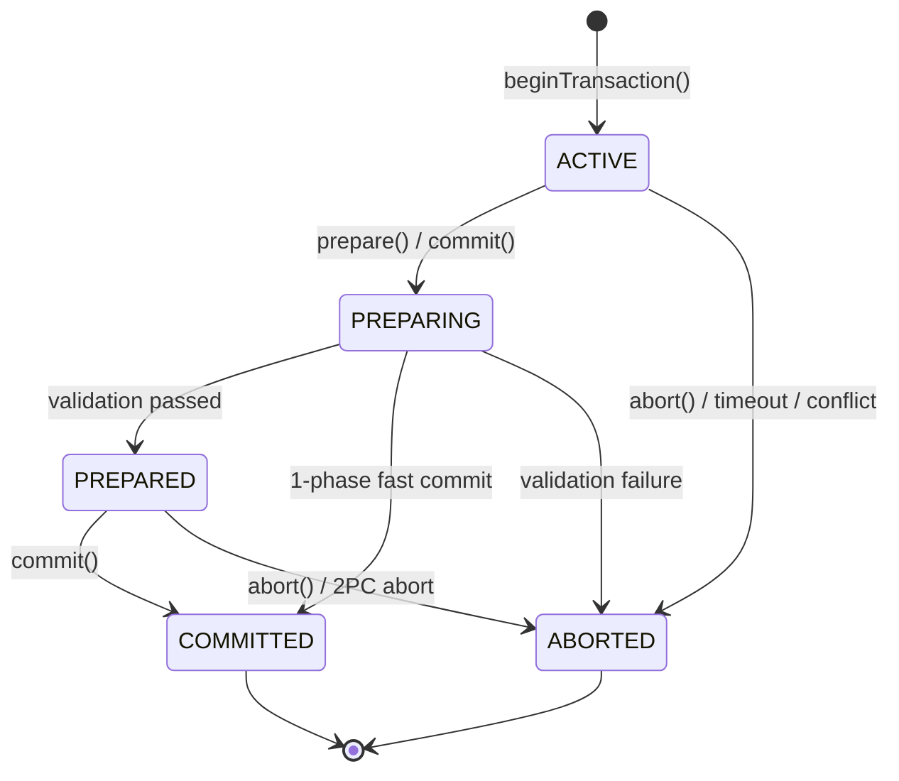
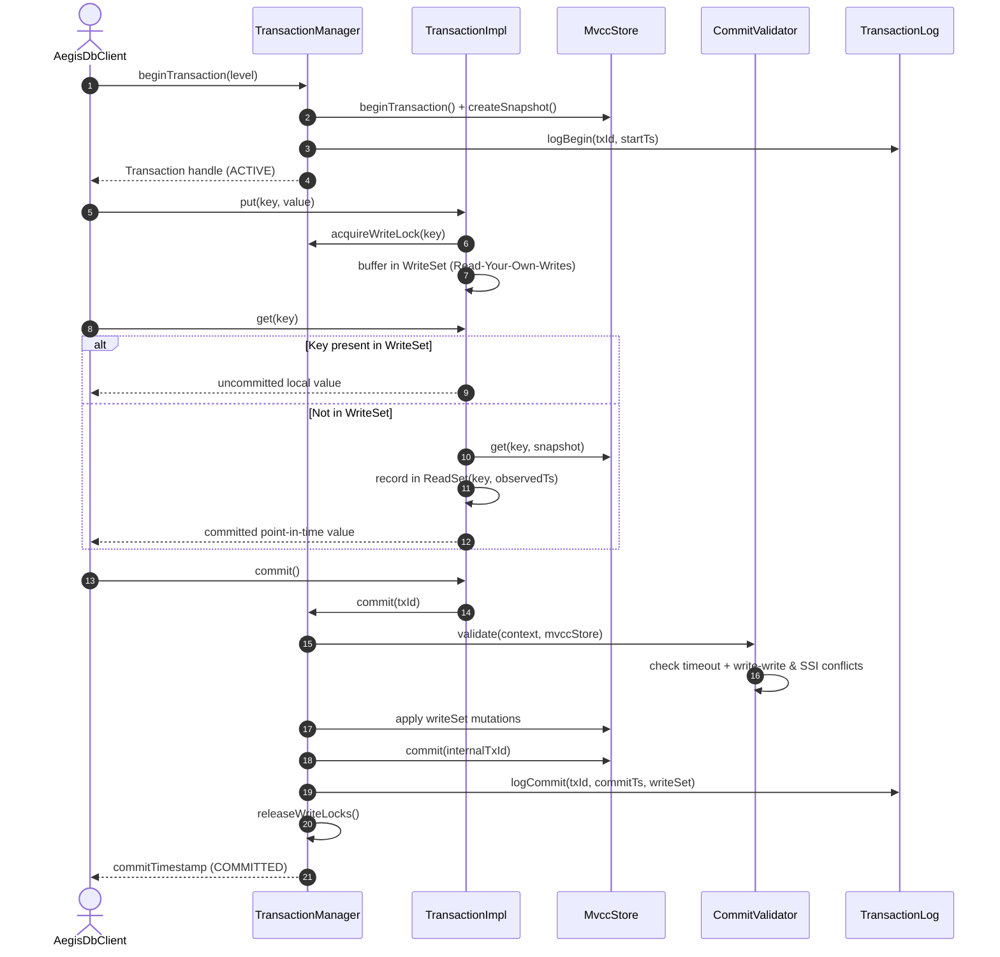

# AegisDB Single-Shard Transaction Engine

## 1. Overview
The `aegisdb_transaction` module implements an ACID-compliant Single-Shard Transaction Engine providing **Snapshot Isolation (SI)** and optional **Serializable Snapshot Isolation (SSI)** per **Master Project Plan §5, §9, §11, §14, §17, §18 & §20 (Sprint 7, US012; Milestone M3 Gate)**.

In AegisDB:
- **Atomicity:** All mutations in a transaction are committed as a single atomic unit or rolled back completely.
- **Consistency:** Transaction invariants (such as balance conservation in financial transfers) are strictly preserved under high multi-threaded contention.
- **Isolation:** Snapshot reads prevent Dirty Reads and Non-Repeatable Reads. First-Committer-Wins prevents Lost Updates and Write-Write conflicts. Read-set validation prevents Write Skew under Serializable mode.
- **Durability:** Transaction lifecycle events (`BEGIN`, `PREPARE`, `COMMIT`, `ABORT`) are persisted to disk via `DurableTransactionLog` with CRC32 checksums and crash recovery.
- **Idempotency:** Repeated `commit` or `abort` calls and client retry requests (`ClientId + RequestId`) are safely suppressed and deduplicated.
- **Resource Security:** Transaction lifetime (TTL) and write-set size are bounded to prevent memory exhaustion and hanging locks (Master Plan §12).

---

## 2. Core Architecture & Classes

```
                          +------------------------+
                          |   TransactionManager   |
                          +-----------+------------+
                                      |
         +----------------------------+----------------------------+
         |                            |                            |
         v                            v                            v
+------------------+         +------------------+         +------------------+
| Transaction      |         |  CommitValidator |         |  TransactionLog  |
| Registry         |         +--------+---------+         | (Durable/InMemory|
+------------------+                  |                   +------------------+
         |                            v                            |
         |                   +------------------+                  v
         |                   | ConflictDetector |              CRC32 Disk
         |                   +--------+---------+                 Frames
         |                            |
         v                            v
+----------------------------------------------------------------------------+
|                             TransactionContext                             |
|  (TxId, IsolationLevel, StartTs, Snapshot, ReadSet, WriteSet, State, TTL)  |
+-------------------------------------+--------------------------------------+
                                      |
                                      v
                               +--------------+
                               |  MvccStore   |
                               +--------------+
```

### 2.1 Component Responsibilities

| Class | Responsibility | Master Plan Reference |
| :--- | :--- | :--- |
| `Transaction` | Public user/client handle (`get()`, `put()`, `delete()`, `prepare()`, `commit()`, `abort()`). | §9 Transaction classes |
| `TransactionManager` | Coordinates transaction lifecycle, concurrency validation, logging, and automated retry loops. | §9 Transaction classes |
| `TransactionContext` | Encapsulates runtime state, isolation level, timestamps, snapshot, and sets. | §9 Transaction classes |
| `TransactionRegistry` | Thread-safe registry tracking active and committed transactions with deduplication. | §9 Transaction classes |
| `ReadSet` | Tracks keys read by the transaction along with their observed commit timestamps. | §9 Transaction classes |
| `WriteSet` | Buffers uncommitted mutations providing Read-Your-Own-Writes and bounded capacity. | §9 Transaction classes |
| `ConflictDetector` | Detects write-write collisions (SI) and read-set anti-dependencies (SSI). | §9 Transaction classes |
| `CommitValidator` | Validates preconditions, TTL expiration, and conflicts during commit/prepare. | §9 Transaction classes |
| `TransactionLog` | Durable append-only journal with CRC32 checksum framing and crash recovery. | §9 Transaction classes |
| `TransactionMetrics` | Tracks `transaction_count`, `commit_count`, `abort_count`, `write_conflicts`. | §15 Operational Diagnostics |

---

## 3. Transaction State Machine

The transaction engine strictly implements the 4-state lifecycle defined in Master Plan §9:



- **ACTIVE:** The transaction is actively reading and buffering mutations in its `WriteSet`.
- **PREPARING:** Preconditions, TTL timeout, and concurrency conflicts are evaluated by `CommitValidator`.
- **PREPARED:** All validation checks passed; write locks are reserved. Prepares single-shard transactions for Sprint 9 Two-Phase Commit (2PC).
- **COMMITTED:** Mutations are atomically applied to `MvccStore`, logged to `TransactionLog`, and write locks are released.
- **ABORTED:** Uncommitted changes are rolled back, write locks are freed, and the outcome is recorded.

---

## 4. Local Transaction Sequence

Per Master Project Plan §24 (*Required Diagrams: Local transaction sequence*):



---

## 5. Concurrency Control & Isolation Roadmap

AegisDB supports two isolation levels (Master Plan §9):

### 5.1 Snapshot Isolation (SI) - Default
- **Dirty Read Prevention:** Readers only access committed versions with $\text{commitTimestamp} \le \text{readTimestamp}$.
- **Non-Repeatable Read Prevention:** Reads remain fixed to the transaction's immutable `Snapshot`.
- **First-Committer-Wins:** If two concurrent transactions attempt to write to the same key, the first to commit succeeds; subsequent transactions are rejected with `WriteConflictException`.

### 5.2 Serializable Snapshot Isolation (SSI) - Advanced
- **Write Skew Prevention:** Detects anti-dependency cycles where concurrent transactions read disjoint keys and write to disjoint keys, yet collectively violate a multi-key integrity constraint.
- **Mechanism:** `ConflictDetector.validateSerializableConflicts()` verifies that no key in `ReadSet` has been committed by another transaction after the reader's start timestamp. Any modification triggers `SerializationFailureException`.

---

## 6. Durable Logging & Crash Recovery

The `DurableTransactionLog` persists lifecycle events using framed binary records (Master Plan §8 & §12):

```
+---------------+---------------+--------------------+------------------+-------------------+
|  Magic (4B)   |  Version (1B) | Record Length (4B) | CRC32 Checksum   | Payload Bytes     |
|  0xAE615D70   |     0x01      |      (int32)       | (8B, uint64)     | (Protobuf/binary) |
+---------------+---------------+--------------------+------------------+-------------------+
```

- **Torn Write Truncation:** If a process crashes abruptly mid-write, partial unchecksummed bytes at EOF are automatically truncated back to the last valid record during startup.
- **Replay:** On restart, `recoverFromLog()` rebuilds the `TransactionRegistry`, restoring committed transaction outcomes and identifying prepared transactions for resolution.

---

## 7. Bank Transfer Invariant Test (Master Plan §14)

Under Sprint 7, the classic bank balance conservation experiment was conducted:
- **Accounts:** $A = 1000, B = 1000, C = 1000$ (Total = $3000$).
- **Workload:** 16 concurrent threads executing thousands of randomized transfers ($A \leftrightarrow B \leftrightarrow C$).
- **Contention Handling:** `runInTransaction()` with automatic conflict detection, abort rollback, and exponential backoff retry.
- **Verification Result:** After completing 5,000+ concurrent transfer operations, the total invariant strictly held:
  $$A + B + C = 3000 \quad (\Delta = 0)$$
  with 100% conservation and zero lost updates.
